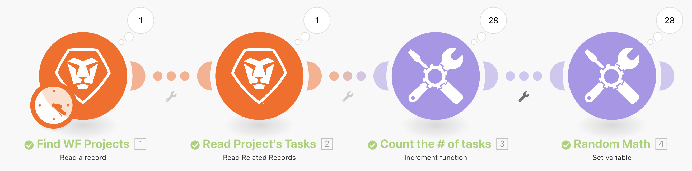

# Introdução aos iteradores

Saiba como usar aplicativos do tipo iteração e executar ações em cada pacote de informações.

## Visão geral do exercício

Examine um projeto específico no Workfront e, em seguida, examine todas as tarefas dentro desse projeto. Você usará o módulo de ferramenta de incremento para contar o número de tarefas no projeto. Por fim, você usará o módulo Definir variável para subtrair o Número de filhos do Número de ocorrências em aberto para produzir um valor numérico para cada um dos pacotes de tarefas.

## Etapas a seguir

**Leia um projeto e tarefas relacionadas.**

1. Inicie um novo cenário. Nomeie-o como &quot;Introdução à iteração&quot;.
1. Escolha Workfront como o módulo acionador, Leia um registro.
1. Para Tipo de Registro, escolha Projeto.
1. Para Saídas, escolha ID, Nome e Descrição.
1. No campo ID , coloque a ID do projeto do projeto Northstar Flashion Exhibitors Booth da instância da unidade de teste do Workfront.
1. Renomeie este módulo como &quot;Localizar Projetos WF&quot;.
1. Adicione outro módulo Workfront para ler as tarefas relacionadas a este projeto. Escolha o módulo Ler Registros Relacionados.
1. Para Tipo de Registro, escolha Projeto.
1. Para a ID de registro pai, escolha a ID no módulo Ler um registro .
1. Para Coleções, selecione Tarefas.
1. Para Saídas, selecione ID, Nome, Descrição, Número de Filhos, Número de Problemas em Aberto e Trabalho.
1. Renomeie este módulo como &quot;Ler Tarefas do Projeto&quot;.
1. Salve o cenário e clique em Executar uma vez para ver as saídas.

   + Clique no inspetor de execução e você verá um pacote como entrada (o projeto) e 28 pacotes como saída (as tarefas).

   **Contar e processar pacotes iterados.**

1. Adicione outro módulo após Ler Registros Relacionados. Escolha um módulo de ferramentas da função Increment .

   + Deixe o campo Reset a value como Never e clique em OK.

1. Renomeie este módulo &quot;Conte o número de tarefas&quot;.
1. Adicione um módulo Definir variável . Defina o nome da variável como &quot;Matemática aleatória&quot;.
1. No campo Variable value , subtraia o número de filhos abertos do número de opTasks abertas.

   **Deve ser assim:**

   

1. Renomeie este módulo como &quot;Matemática Aleatória&quot;.
1. Salve o cenário e clique em Executar uma vez.

Para cada uma das tarefas produzidas pelo módulo iterador Ler Registros Relacionados, o Workfront Fusion executou 28 execuções. Esses 28 pacotes continuarão a ser processados em todo o cenário, a menos que um agregador seja adicionado para fechar o loop.
