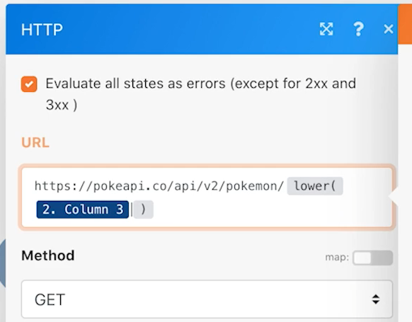

# Introdução aos conectores universais

Expanda a compreensão do trabalho com conectores universais REST e do trabalho com os dados retornados.

## Visão geral do exercício

Usando um caractere Pokemon em uma planilha, chame a API Poke por meio de um conector HTTP para coletar e publicar mais informações sobre esse caractere.

## Etapas a seguir

**Baixe o arquivo CSV no Workfront.**

1. Na pasta &quot;Fusion Exercise Files&quot; da Workfront, selecione &quot;_Fusion2020_Shipping Manifest.csv&quot; e clique em Detalhes do Documento.
1. Copie o primeiro número de ID do endereço de URL.
1. Crie um novo cenário no Workfront Fusion. Nomeie-o como &quot;Usando conectores universais&quot;.
1. Comece com o módulo Baixar documento do aplicativo Workfront.
1. Configure sua conexão com o Workfront e inclua a ID do documento copiada do URL do Workfront.
1. Renomeie este módulo como &quot;Baixar manifesto de envio&quot;.

   

   **Analise os dados do manifesto de envio.**

1. Adicione outro módulo, selecionando Analisar CSV.
1. Configure Analisar CSV para 11 colunas. Marque a caixa CSV contains headers . Escolha Comma delimiterType e coloque Data do módulo Download Document no campo CSV.

   

1. Renomeie este módulo como &quot;Analisar manifesto de envio&quot;.
1. Salve o cenário e clique em Executar uma vez para ver os dados do arquivo CSV nas próximas etapas.

   **Obtenha os dados Pokemon usando o conector universal.**

1. Adicionar um módulo HTTP Fazer uma solicitação .
1. No campo URL , use `https://pokeapi.co/api/v2/pokemon/[Character]`, onde [Caractere] é mapeado para a Coluna 3 do módulo CSV de análise.
1. Marque a caixa de seleção Analisar resposta .
1. Selecione Mostrar configurações avançadas e marque a caixa ao lado de &quot;Avaliar todos os estados como erros&quot;.
1. Clique em OK e renomeie o módulo &quot;Obter informações do Pokemon&quot;.

   **O painel de mapeamento deve ter esta aparência:**

   

   **Nessa parte do exercício, você deseja processar apenas a linha 1 no arquivo CSV.**

1. Adicione um filtro antes do módulo Obter informações do Pokemon. Nomeie de &quot;Somente a linha 1&quot;.
1. Defina a condição para permitir que somente o número de ID 1 passe. O número de ID 1 está na linha 1 e o campo de ID está na Coluna 1 do arquivo CSV.

   

1. Salve o cenário.
1. Clique em Executar uma vez e observe a mensagem de erro recebida no módulo HTTP Fazer uma solicitação .

   >[!IMPORTANT]
   >
   >Observe que, no campo de URL de dados de entrada, o nome do caractere está em maiúsculas. Isso não funcionará para fazer essa chamada de API porque os nomes de caracteres precisam estar em minúsculas.

   

1. Use o painel de mapeamento no campo HTTP Faça uma solicitação do URL para fazer a variável [Caractere] todas as letras minúsculas usando o **lower** .

   

   **Mapeie as informações da API usando o módulo Definir várias variáveis .**

1. Adicione o módulo Definir várias variáveis após as informações de Get Pokemon. Nome do mapa, altura, peso e capacidades.
1. Como o campo Capacidades é uma matriz, lembre-se de usar a função de mapa para acessar o nome de cada capacidade na matriz.

   

   **Execute o cenário sem o filtro para descobrir outro erro.**

1. Para processar todas as linhas no arquivo CSV, exclua o filtro denominado Only row 1:

   + Clique no ícone de filtro para editá-lo.
   + Exclua o rótulo do filtro.
   + Excluir a condição.
   + Clique em OK.

1. Salve o cenário e clique em Executar uma vez.
1. Ocorre um erro no módulo de informações Get Pokemon. Você vê que um personagem de super-herói foi passado para a API Pokemon.

   >[!NOTE]
   >
   >Na apresentação dos Roteadores, você verá como resolver esse erro criando um caminho separado para processar super-heróis.

   
