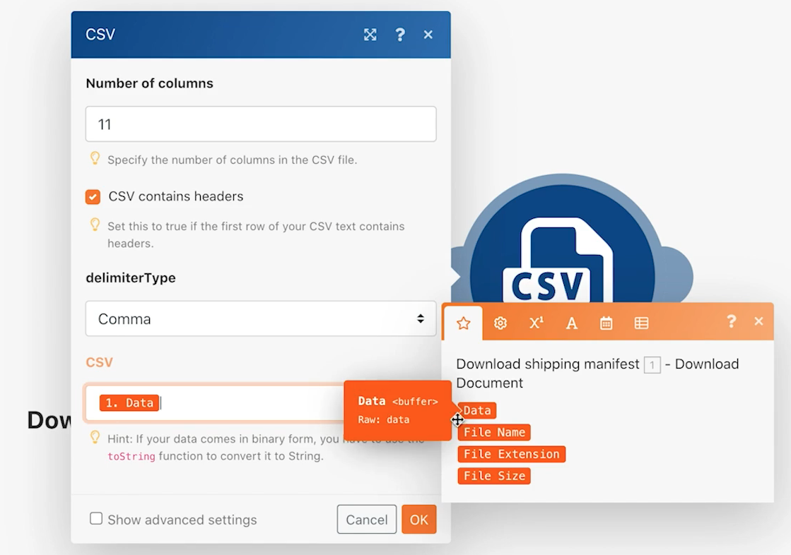

# Exercício de introdução a conectores universais

Amplie sua compreensão de trabalhar com conectores universais REST e com os dados retornados.

## Visão geral do exercício

Usando um caractere Pokemon em uma planilha, chame a API Poke por meio de um conector HTTP para coletar e publicar mais informações sobre esse caractere.

## Etapas a serem seguidas

**Baixe o arquivo CSV do Workfront.**

1. Na pasta “Arquivos de exercício do Fusion” no Workfront, selecione “_Fusion2020_Shipping Manifest.csv” e clique em Detalhes do documento.
1. Copie o primeiro número de ID do endereço URL.
1. Crie um novo cenário no Workfront Fusion. Nomeie como “Utilização de conectores universais”.
1. Comece com o módulo Baixar documento do aplicativo Workfront.
1. Configure sua conexão com o Workfront e inclua a ID do documento copiada do URL do Workfront.
1. Renomeie esse módulo como “Baixar manifesto de envio”.

   

   **Analise os dados do manifesto de envio.**

1. Adicione outro módulo, selecionando Analisar CSV.
1. Configure Analisar CSV para 11 colunas. Marque a caixa CSV contém cabeçalhos. Escolha o tipo de delimitador como Vírgula e coloque os dados do módulo Baixar documento no campo CSV.

   

1. Renomeie este módulo como “Analisar manifesto de envio”.
1. Salve o cenário e clique em Executar uma vez para que você possa ver os dados do arquivo CSV nas próximas etapas.

   **Obtenha os dados de Pokemon usando o conector universal.**

1. Adicione um módulo HTTP Fazer uma solicitação.
1. No campo URL, use `https://pokeapi.co/api/v2/pokemon/[Character]`, onde [Caractere] é mapeado para a Coluna 3 do módulo Analisar CSV.
1. Marque a caixa de seleção Analisar resposta.
1. Selecione Mostrar configurações avançadas e marque a caixa ao lado de “Avaliar todos os estados como erros”.
1. Clique em OK e renomeie o módulo “Obter informações de Pokemon”.

   **Seu painel de mapeamento deve ter esta aparência:**

   

   **Nesta parte do exercício, você só deseja processar a linha 1 no arquivo CSV.**

1. Adicione um filtro antes do módulo Obter informações de Pokemon. Nomeie-o como “Somente a linha 1”.
1. Defina a condição para permitir apenas a passagem da ID número 1. A ID número 1 está na linha 1, e o campo ID está na Coluna 1 no arquivo CSV.

   

1. Salve o cenário.
1. Clique em Executar uma vez e observe a mensagem de erro que você recebe no módulo HTTP Fazer uma solicitação.

   >[!IMPORTANT]
   >
   >Observe no campo URL dos dados de entrada que o nome do caractere está em maiúscula. Isso não funcionará para fazer essa chamada de API porque os nomes dos caracteres precisam estar em minúsculas.

   

1. Use o painel de mapeamento no campo URL HTTP Fazer uma solicitação para deixar campo [Caractere] todo em minúsculas usando a função **minúscula**.

   

   **Mapeie as informações de volta da API usando o módulo Definir variáveis múltiplas.**

1. Adicione o módulo Definir variáveis múltiplas após Obter informações de Pokemon. Mapeie nome, altura, peso e habilidades.
1. Como o campo Habilidades é uma matriz, lembre-se de usar a função de mapa para acessar o nome de cada habilidade na matriz.

   

   **Execute o cenário sem o filtro para descobrir outro erro.**

1. Para processar todas as linhas no arquivo CSV, exclua o filtro chamado Somente linha 1:

   + Clique no ícone de filtro para editá-lo.
   + Exclua o rótulo do filtro.
   + Exclua a Condição.
   + Clique em OK.

1. Salve o cenário e clique em Executar uma vez.
1. Ocorre um erro no módulo Obter informações do Pokemon. Você vê que um caractere super-herói foi passado para a API Pokemon.

   >[!NOTE]
   >
   >Na apresentação dos Roteadores, você verá como resolver esse erro criando um caminho separado para processar super-heróis.

   
