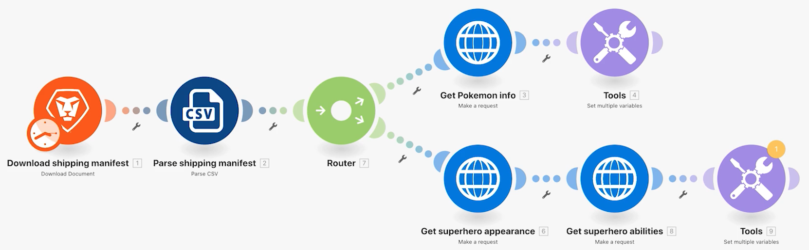

# Roteadores

Entenda a importância dos roteadores e como eles podem ser usados para processar condicionalmente diferentes módulos.

## Visão geral do exercício

Use um roteador para passar Pokemon vs. super-heróis empacota o caminho correto e, em seguida, crie uma tarefa para cada personagem.

## Etapas a serem seguidas

1. Clonar o cenário Uso de conectores universais do exercício anterior. Nomeie-o &quot;Criação de caminhos diferentes usando roteadores&quot;.

   **Crie um novo caminho para super-heróis clonando módulos e adicionando um roteador.**

   

1. Clique com o botão direito do mouse no módulo Get Pokemon info e escolha Clone. Depois de clonado, arraste e conecte-o à linha entre o novo módulo HTTP e o módulo CSV de análise.

   >[!NOTE]
   >
   > Observe como ele adiciona automaticamente um roteador com dois caminhos.

1. Nomeie esse módulo como &quot;Obter aparência de super-herói&quot;.
1. Clonar este módulo, mover o clone para a direita e nomeá-lo como &quot;Obter habilidades de super-herói&quot;.
1. Clonar o módulo Ferramentas e movê-lo para o final do segundo caminho.
1. Clique no ícone de varinha - o botão Alinhamento automático - na barra de ferramentas.

   **Seu cenário deve ficar assim:**

   

   **Em seguida, você alterará os valores mapeados nos novos módulos clonados.**

1. Ir para <https://www.superheroapi.com/> e use sua conta do Facebook para obter um token de acesso.

   >[!NOTE]
   >
   >Se você tiver problemas para acessar seu próprio token de super-herói, poderá usar esse token compartilhado: 10110256647253588. Considere quantas vezes você chama a API de super-herói para que esse token compartilhado continue a funcionar para todos.

1. Abra as configurações para Obter aparência de super-herói e altere o URL para `https://www.superheroapi.com/api/[access- token]/332/appearance`. Certifique-se de incluir seu token de acesso no URL. Clique em OK.
1. Abra as configurações para Obter habilidades de super-herói e altere o URL para `https://www.superheroapi.com/api/[access- token]/332/powerstats`. Certifique-se de incluir seu token de acesso no URL. Clique em OK.
1. Clique com o botão direito do mouse em cada módulo super-herói e selecione Somente executar este módulo. Isso gerará a estrutura de dados que você precisa ver para o mapeamento.
1. Depois de executar ambos, altere o número &quot;332&quot; em cada campo de URL para a Coluna 4 mapeada do módulo Analisar CSV.

   

   **Agora você pode clicar no módulo Definir várias variáveis no caminho super-herói e atualizar o nome, a altura, o peso e as habilidades.**

1. Atualize os campos Nome e Habilidades do módulo Obter habilidades de super-herói — Módulo 8.

   

1. Atualize os campos Altura e Peso do módulo Obter aparência super-herói - Módulo 6.

   

   **Quando terminar, suas variáveis deverão ter esta aparência. Observe que os números do módulo aparecem nos valores do campo.**

   

1. Clique em OK e salve o cenário.

   **Crie outro caminho para criar uma tarefa por caractere.**

1. No Workfront, crie um projeto vazio. Nomeie-o como &quot;Projeto de manifesto de remessa&quot; e copie a ID do projeto do URL.
1. Retorne ao Workfront Fusion e clique em, no centro do roteador, para criar outro caminho.

   

1. Clique em no centro do módulo vazio que é exibido e adicione um módulo Criar registro do aplicativo Workfront.
1. Defina o Tipo de registro como Tarefa e selecione ID do projeto na seção Campos a mapear.
1. Cole a ID do projeto copiada do Workfront no campo ID do projeto.
1. Agora, selecione o campo Nome na seção Campos a Mapear.
1. Nomeie a tarefa &quot;[Caractere] de [Franquia],&quot; retirando o nome do caractere e o nome da franquia do arquivo CSV. A coluna 3 é o nome do personagem e a coluna 2 é o nome da franquia.

   

1. Clique em OK e renomeie este módulo para &quot;Criar uma tarefa para cada caractere&quot;.

   **Adicione filtros para que o cenário possa ser executado sem erros. Você quer que apenas personagens Pokemon percorram o caminho superior, que apenas personagens super-heróis percorram o caminho central e que todos os personagens percorram o caminho inferior.**

1. Clique na linha pontilhada à esquerda do módulo Obter informações de Pokemon para criar o primeiro filtro. Nomeie-o de &quot;personagem Pokemon&quot;.
1. Para a condição, apenas permita registros onde a franquia (Coluna 2) é igual a &quot;Pokemon&quot;. Escolha o texto &quot;Igual a&quot;.
1. Clique na linha pontilhada à esquerda do módulo Obter aparência de super-herói para criar o próximo filtro. Nomeie de &quot;Personagem super-herói&quot;.
1. Como os super-heróis podem vir de várias franquias, use o campo ID de super-herói (Coluna 4) para determinar se um personagem é um super-herói ou não.

   **Seus filtros devem ter esta aparência:**

   

   

1. Salve o cenário e clique em Executar uma vez. Use os inspetores de execução para verificar se todas as operações foram bem-sucedidas e verifique as tarefas que foram criadas em seu projeto do Workfront.

   
