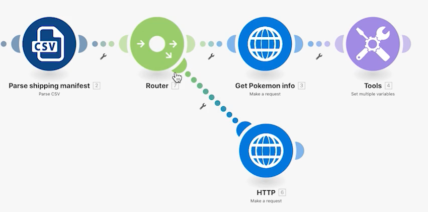
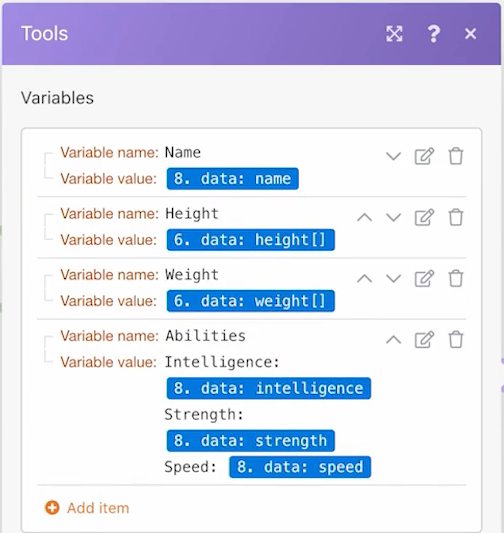

# Roteadores

Entenda a importância dos roteadores e como eles podem ser usados para processar condicionalmente módulos diferentes.

## Visão geral do exercício

Use um roteador para passar Pokemon vs. super-heróis para baixo no caminho correto e crie uma tarefa para cada caractere.

## Etapas a seguir

1. Clona o cenário Uso de conectores universais do exercício anterior. Nomeie-o como &quot;Criando caminhos diferentes usando roteadores&quot;.

   **Crie um novo caminho para super-heróis clonando módulos e adicionando um roteador.**

   

1. Clique com o botão direito do mouse no módulo Obter informações do Pokemon e escolha Clonar. Depois de clonado, arraste-o e conecte-o à linha entre o novo módulo HTTP e o módulo CSV de análise.

   >[!NOTE]
   >
   > Observe como ele adiciona automaticamente um roteador com dois caminhos.

1. Nomeie este módulo como &quot;Obter aparência de super-herói&quot;.
1. Clonar este módulo, mover o clone para a direita, e nomeá-lo como &quot;Capturar habilidades de super-heróis&quot;.
1. Clona o módulo Ferramentas e mova-o para o final do segundo caminho.
1. Clique no ícone da varinha - o botão Alinhamento automático - na barra de ferramentas.

   **O cenário deve ser semelhante a:**

   

   **Em seguida, você alterará os valores mapeados nos novos módulos clonados.**

1. Ir para <https://www.superheroapi.com/> e use sua conta do Facebook para obter um token de acesso.

   >[!NOTE]
   >
   >Se tiver problemas para acessar seu próprio token de super-herói, você pode usar este token compartilhado: 10110256647253588. Considere quantas vezes você chama a API de super-herói para que esse token compartilhado continue a funcionar para todos.

1. Abra as configurações para a aparência de superherói Get e altere o URL para `https://www.superheroapi.com/api/[access- token]/332/appearance`. Certifique-se de incluir o token de acesso no URL. Clique em OK.
1. Abra as configurações para as habilidades do super-herói Get e altere o URL para `https://www.superheroapi.com/api/[access- token]/332/powerstats`. Certifique-se de incluir o token de acesso no URL. Clique em OK.
1. Clique com o botão direito do mouse em cada módulo de super-herói e selecione Executar este módulo somente. Isso gerará a estrutura de dados que você precisa ver para mapeamento.
1. Depois de executar os dois, altere o número &quot;332&quot; em cada campo de URL para a Coluna 4 mapeada do módulo CSV de análise.

   

   **Agora você pode clicar no módulo Definir várias variáveis no caminho do super-herói e atualizar o nome, a altura, o peso e as capacidades.**

1. Atualize os campos Nome e Capacidades do módulo Obter habilidades de super-heróis — Módulo 8.

   

1. Atualize os campos Altura e Peso do módulo Obter aparência de superherói — Módulo 6.

   

   **Quando terminar, suas variáveis devem ficar assim. Observe que os números de módulo são exibidos nos valores de campo.**

   

1. Clique em OK e salve seu cenário.

   **Crie outro caminho para criar uma tarefa por caractere.**

1. No Workfront, crie um projeto vazio. Nomeie-o como &quot;Projeto de manifesto de entrega&quot; e copie a ID do projeto do URL.
1. Retorne ao Workfront Fusion e clique no centro do roteador para criar outro caminho.

   

1. Clique no centro do módulo vazio que aparece e adicione um módulo de registro Create do aplicativo Workfront.
1. Defina o Tipo de registro como Tarefa e selecione ID do projeto na seção Campos para mapa .
1. Cole a ID do projeto copiada do Workfront no campo ID do projeto .
1. Agora, selecione o campo Nome na seção Campos a serem mapeados.
1. Nomeie a tarefa &quot;[Caractere] from [franquia],&quot; utilizando o nome do caractere e o nome da franquia do arquivo CSV. A coluna 3 é o nome do caractere e a coluna 2 é o nome da franquia.

   

1. Clique em OK e renomeie este módulo para &quot;Criar uma tarefa para cada caractere&quot;.

   **Adicione filtros para que o cenário possa ser executado sem erros. Você deseja que somente caracteres Pokemon abram o caminho superior, somente caracteres de super-herói para descer pelo caminho do meio, e todos os caracteres para descer pelo caminho inferior.**

1. Clique na linha pontilhada à esquerda do módulo de informações Get Pokemon para criar o primeiro filtro. Nomeie de &quot;caractere Pokemon&quot;.
1. Para a condição, permita apenas registros em que a franquia (Coluna 2) seja igual a &quot;Pokemon&quot;. Escolha o operador &quot;Equal to&quot; de texto.
1. Clique na linha pontilhada à esquerda do módulo Get superhero appearance para criar o próximo filtro. Nomeie-o como &quot;personagem de super-herói&quot;.
1. Como os super-heróis podem vir de várias franquias, use o campo ID de Superherói (Coluna 4) para determinar se um caractere é ou não um super-herói.

   **Seus filtros devem ter esta aparência:**

   

   

1. Salve o cenário e clique em Executar uma vez. Use os inspetores de execução para verificar se todas as operações foram bem-sucedidas e verificar as tarefas que foram criadas no seu projeto do Workfront.

   
