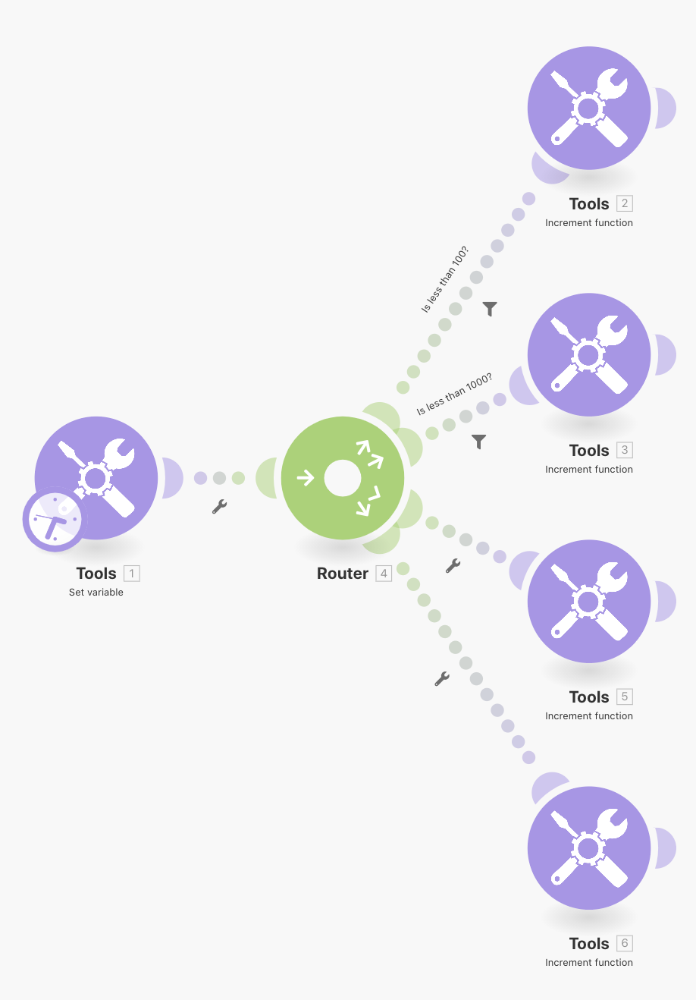

# Padrões de roteamento

Reforce seu conceito de roteamento e rotas de fallback sem realmente lidar com outras APIs.

## Visão geral do exercício

Use o módulo Set Variable para enviar um número por vários caminhos para ver como os filtros e os fallbacks se comportam durante o roteamento.

## Etapas a serem seguidas

1. Crie um novo cenário e chame-o de &quot;Padrões de roteamento e fallbacks&quot;.
1. Para o acionador, adicione o módulo da ferramenta Definir variável. Coloque &quot;My Number&quot; no nome da variável, deixe o tempo de vida da variável como One cycle e defina o campo Variable como &quot;75&quot;.

   

1. Adicione outro módulo e escolha o módulo Roteador. Para ambos os caminhos, escolha a ferramenta da função Incremento e clique em OK sem fazer alterações para cada um.

   + Para o primeiro caminho, crie um filtro, nomeie-o como &quot;Menor que 100&quot; e defina a condição como [Meu número] Menos de 100.

   + Para o segundo caminho, crie um filtro, nomeie-o como &quot;Menor que 1000&quot; e defina a condição como [Meu número] Menos de 1000. Use o operador numérico para ambos.

   

   

1. Clique em Executar uma vez e veja o pacote passar o caminho &quot;Menos de 100&quot;.
1. Em seguida, altere o campo Set Variable module para 950 e execute novamente. Observe-o percorrer o segundo caminho.
1. Clique no roteador e adicione mais um caminho. Adicione o módulo de ferramenta da função Incremento. Para o filtro, clique em &quot;A rota de fallback&quot;. Observe como a seta apontando para esse caminho muda para um sinal de interpolação, indicando que é a rota de fallback.

   

1. Altere o número da variável Set para 9500 e Run once (Executar uma vez). Como o número não é inferior a 100 nem inferior a 1000, o pacote percorre a rota de fallback.

Se você adicionar mais um caminho com um módulo de ferramenta da função Incremento, mas não definir nenhum filtro, o que acontecerá quando você clicar em Executar novamente? Um pacote entrará na rota de fallback com a quarta rota adicionada?

+ Não, porque sem um filtro definido, todos os pacotes sempre seguirão por esse caminho em vez da rota de fallback.
