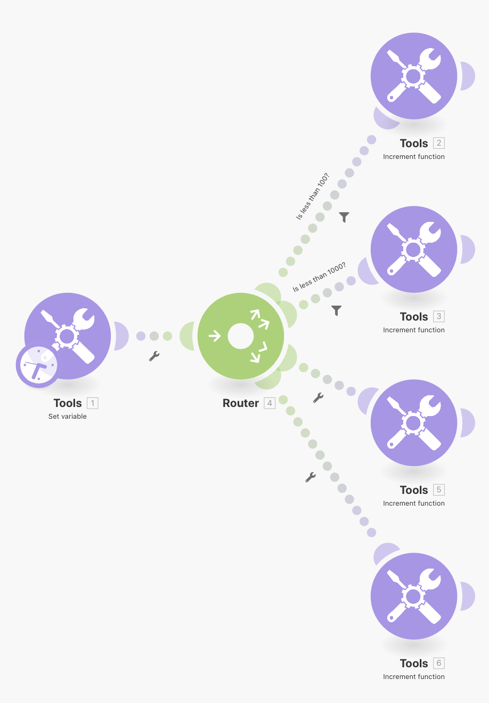
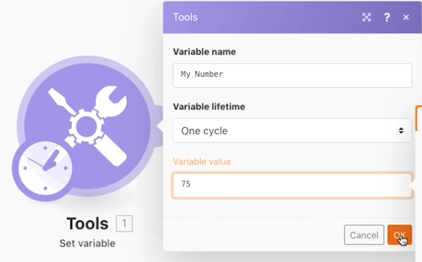
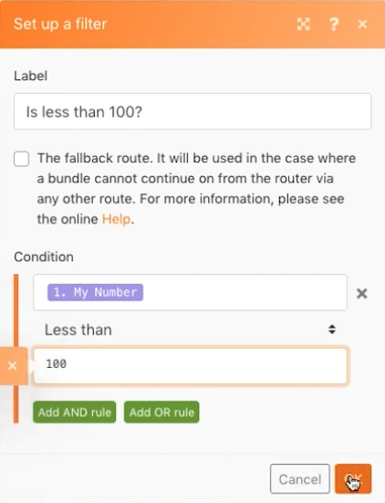
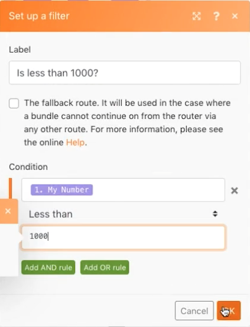
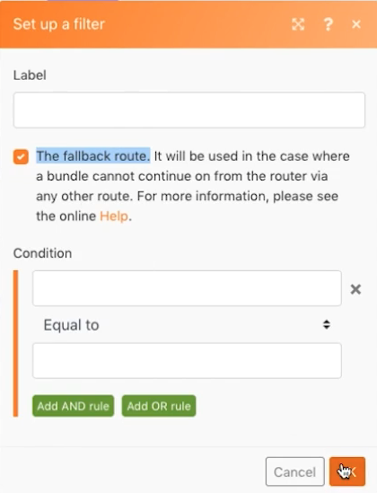

# Exercício sobre padrões de roteamento

Reforce seu conceito de roteamento e rotas de fallback sem de fato lidar com outras APIs.

## Visão geral do exercício

Use o módulo Definir variável para enviar um número por vários caminhos e ver como os filtros e fallbacks se comportam durante o roteamento.

## Etapas a serem seguidas

1. Crie um novo cenário e nomeie-o “Padrões de roteamento e fallbacks”.
1. Para o acionador, adicione o módulo de ferramenta Definir variável. Coloque “Meu número” no nome da variável, deixe o tempo de vida da variável como Um ciclo e defina o campo Variável como “75”.

   

1. Adicione outro módulo e escolha o módulo Roteador. Para ambos os caminhos, escolha a ferramenta da função Incremento e clique em OK sem fazer alterações para cada um.

   + Para o primeiro caminho, crie um filtro, nomeie-o como “Menor que 100” e defina a condição como [Meu número] Menor que 100.

   + Para o segundo caminho, crie um filtro, nomeie-o como “Menos que 1.000” e defina a condição como [Meu número] Menor que 1.000. Use o operador numérico para ambos.

   

   

1. Clique em Executar uma vez e veja o pacote percorrer o caminho “Menor que 100”.
1. Em seguida, altere o campo do módulo Definir variável para 950 e clique novamente em Executar uma vez. Observe-o percorrer o segundo caminho.
1. Clique no roteador e adicione mais um caminho. Adicione o módulo de ferramenta da função Incremento. Para o filtro, clique na caixa de seleção “Rota de fallback”. Observe como a seta apontando para o caminho muda para um cursor de texto, indicando que é a rota de fallback.

   

1. Altere o número de Definir variável para 9.500 e clique em Executar uma vez. Como o número não é inferior a 100 nem inferior a 1.000, o pacote percorre a rota de fallback.

Se você adicionar mais um caminho com um módulo de ferramenta da função Incremento, mas não definir nenhum filtro, o que acontecerá quando você clicar novamente em Executar uma vez? Um pacote entrará na rota de fallback com a adição da quarta rota?

+ Não, porque sem um filtro definido, todos os pacotes sempre seguirão por esse caminho em vez da rota de fallback.
