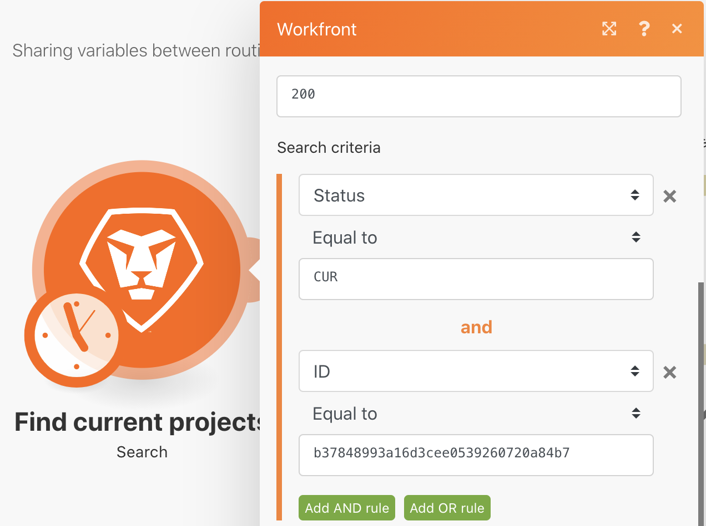

# Definir/obter variáveis

Saiba como usar os módulos Definir e obter variáveis para usar os campos disponíveis em um caminho em um caminho diferente.

## Visão geral do exercício

Procure informações sobre um projeto no Workfront e envie um email com informações relacionadas.

## Etapas a seguir

1. Crie um novo cenário e o nomeie como &quot;Compartilhando variáveis entre caminhos de roteamento&quot;.
1. Para o acionador , selecione o módulo Pesquisar no aplicativo Workfront.

   + Defina o Tipo de Registro como Projeto.
   + Para o conjunto de resultados, escolha Todos os registros correspondentes.
   + Para critérios de Pesquisa, defina-o como Status Equal to CUR.
   + Para Saídas, escolha ID, Nome, Descrição e ID do Patrocinador.

   

   

1. Clique em OK e renomeie este módulo como &quot;Encontrar projetos atuais&quot;.
1. Adicione outro módulo e selecione o módulo Workfront Read a record .

   + Para o Tipo de Registro, escolha Usuário.
   + Para Saídas, escolha Nome.
   + Mapeie a ID do patrocinador do módulo de Pesquisa para o campo de ID.

1. Clique em OK.
1. Renomeie o módulo &quot;Localizar nome do patrocinador&quot;.

   

1. Salve o cenário e clique em Executar uma vez.

   Se você receber um erro no módulo Ler um registro, é provável que o módulo Pesquisar encontre um projeto sem um patrocinador listado.

   **Para evitar esse erro, crie dois caminhos: um para projetos que têm ID de patrocinador e outro para projetos que não têm.**

1. Adicione um roteador entre os dois módulos clicando no ícone de chave entre o roteador e o módulo Read a record . Configure um filtro chamado &quot;Patrocinador existe&quot; e defina a Condição como ID do patrocinador existe.

   

1. Clique no roteador para criar outro caminho. Adicione um módulo Enviar um email do aplicativo Email .

   + Coloque seu próprio endereço de email no campo Para .
   + No campo Assunto, digite &quot;Informações atuais do projeto&quot;.
   + No campo Content , coloque o nome do projeto, a descrição e o patrocinador.
   + Não é possível obter a saída do nome do patrocinador do módulo Read a record . Você só pode acessar a ID do patrocinador do módulo de pesquisa antes do roteador. Você precisará encontrar uma maneira de acessar o nome do patrocinador do outro caminho do roteador.

   

1. Clique em OK por enquanto e renomeie este módulo como &quot;Enviar informações do projeto&quot;

   **Use as variáveis Definir/Obter para compartilhar dados entre caminhos diferentes.**

1. Depois do módulo Find patrosor name , adicione um módulo de ferramenta Set variable .

   + Coloque &quot;Nome do patrocinador&quot; como o nome da Variável.
   + Deixe o tempo de vida da variável em um ciclo.
   + Mapeie o campo para a saída do nome do módulo Find patrocinador name .

1. Clique em OK e renomeie o módulo &quot;Definir nome do patrocinador&quot;.

   

1. Em seguida, clique com o botão direito do mouse entre o roteador e o módulo Send an email para adicionar um módulo de ferramenta Get variable . Digite &quot;Nome do patrocinador&quot; no campo Nome da variável .
1. Clique em OK. Renomeie o módulo &quot;Obter nome do patrocinador&quot;.

   

1. Retorne ao módulo Send an email e mapeie o valor do módulo Get Sponsor name para o campo de conteúdo. Clique em OK.

   

   >[!IMPORTANT]
   >
   >Antes de testar o cenário, recomendamos restringir o número de projetos que você processa para evitar a obtenção de um fluxo de emails.

1. Vá para a unidade de teste do Workfront e localize o projeto Northstar Fashion Exhibitors Booth. Este é um projeto atual que tem um patrocinador. Copie a ID do projeto do URL.

   

1. No seu cenário, clique no módulo Find current projects . Adicione outra condição aos critérios de pesquisa clicando no botão verde &quot;Adicionar regra E&quot;. Especifique que a ID deve ser igual à ID do projeto copiada. Clique em OK.
1. Salve o cenário e clique em Executar uma vez.
1. Revise os inspetores de execução e o email recebido.

   
