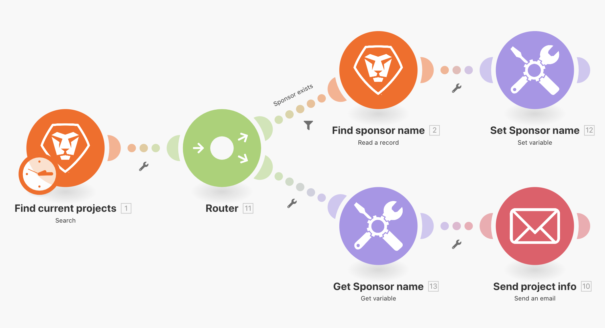
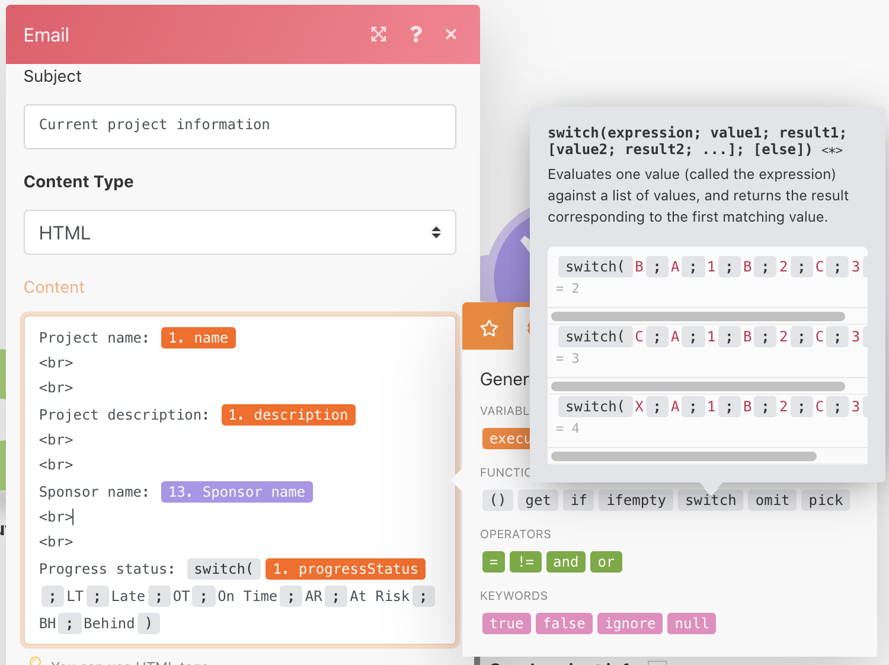

# Exercício sobre a função Alternar

Saiba como alternar funcionalidades utilizando a função Alternar.

## Visão geral do exercício

Para alterações simples de dados, use a função Alternar para transformar um valor de um campo de módulo em outro valor. Neste exercício, altere a chave de duas letras para o nome real do status de progresso do projeto e envie-o por email.

## Etapas a serem seguidas

1. Clone o cenário chamado “Compartilhar variáveis entre caminhos de roteamento”.
1. Nomeie o novo cenário como “Compartilhamento de variáveis entre caminhos de roteamento - Alternar”.
1. Clique no módulo acionador e adicione Status do progresso à seção Saídas.
1. No módulo Enviar um email, adicione Status do progresso ao campo Conteúdo.

   + Se você apenas sobrescrever o valor proveniente do módulo Pesquisar, haverá um código de duas letras como o status do progresso.
   + Para “alternar” o código pelo nome completo de cada possível status do progresso, use a função “alternar” da guia Funções gerais.

1. A função Alternar usa o valor ou expressão do status do progresso como chave e, em seguida, retorna o valor de saída com base nessa chave.

   + Um valor-chave é definido na primeira posição após o status do progresso (“AT”) com a saída correspondente definida na segunda posição (“Atrasado”).
   + O valor-chave seguinte é definido na terceira posição, com a saída correspondente definida na quarta posição, e esse processo se repete para o número de chaves desejadas.

     
