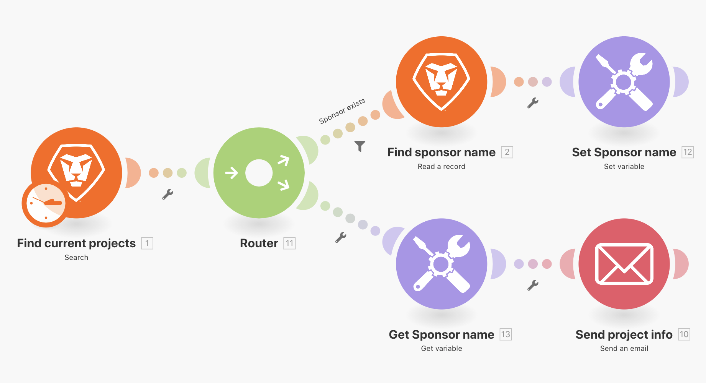

# Alternar função

Saiba como usar a funcionalidade de switch usando a função Switch.

## Visão geral do exercício

Para alterações de dados simples, use a função Switch para transformar um valor em outro em um campo de módulo. Neste exercício, altere a tecla de duas letras para o nome real do status de progresso do projeto para enviar um email.

## Etapas a serem seguidas

1. Clonar o cenário chamado &quot;Compartilhamento de variáveis entre caminhos de roteamento&quot;.
1. Nomeie o novo cenário como &quot;Compartilhamento de variáveis entre caminhos de roteamento - Switch&quot;.
1. Clique no módulo do acionador e adicione o Status do progresso à seção Saídas.
1. No módulo Enviar um email, adicione o Status de progresso ao campo Conteúdo.

   + Se você apenas mapear o valor proveniente do módulo de Pesquisa, há um código de duas letras para o status de progresso.
   + Para &quot;alternar&quot; o código do nome completo de cada status de progresso possível, use a função &quot;alternar&quot; na guia General functions.

1. A função switch usa o valor ou a expressão Progress Status como uma chave e retorna o valor de saída com base nessa chave.

   + Um valor principal é definido na primeira posição após o Status do Progresso (&quot;LT&quot;) com a saída correspondente definida na segunda posição (&quot;Late&quot;).
   + O próximo valor de chave é definido na terceira posição, com a saída correspondente definida na quarta posição, etc., para quantas chaves desejar.

     
