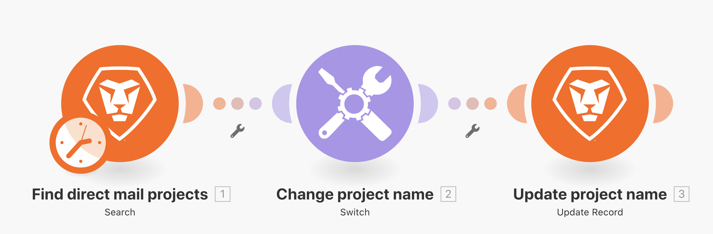
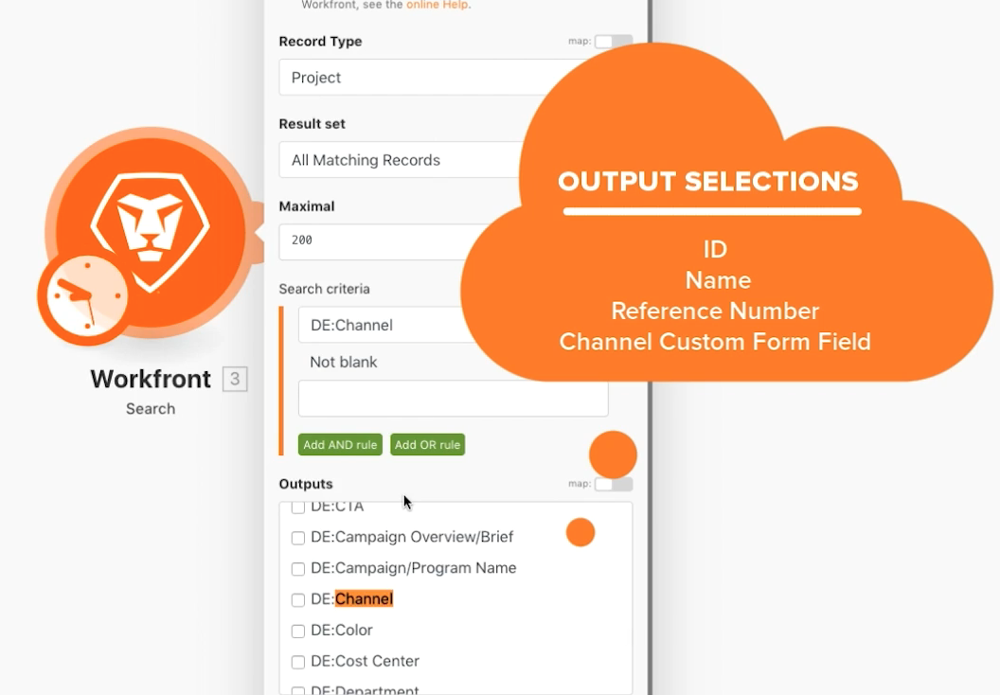
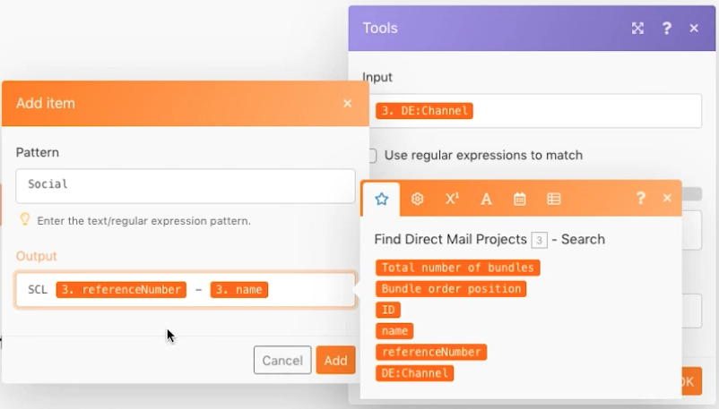
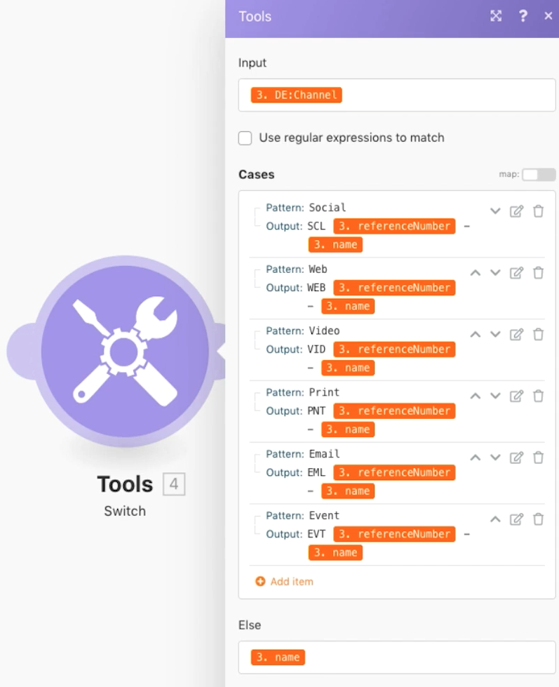
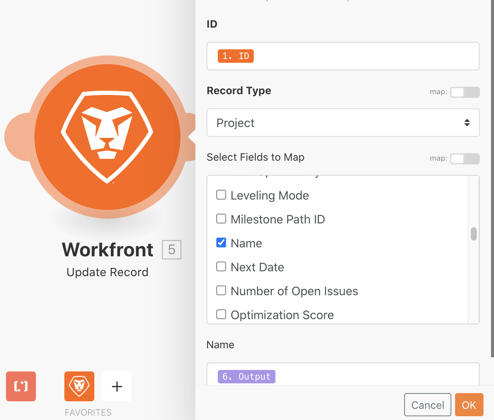

# Exercício do módulo de comutação

Entenda como usar o módulo de comutação quando precisar executar transformações de dados mais complexas ou dinâmicas.

## Visão geral do exercício

Procure projetos de correspondência direta na unidade de teste e altere o nome de cada projeto com base num valor selecionado num campo personalizado anexado ao projeto.

## Etapas a serem seguidas

1. Crie um novo cenário e nomeie-o como “Usando o módulo Alternar”.
1. Para o módulo acionador, use o módulo Workfront Search.
1. Configure sua conexão com o Workfront e defina o tipo de registro como Projeto.
1. Nos critérios de Pesquisa, especifique que deseja ver apenas os projetos que têm um valor no campo personalizado Canal.
1. Para saídas, selecione ID, Nome, Número de referência e o campo personalizado Canal.

   

1. Adicione o módulo Alternar em Ferramentas.
1. Para o campo de Entrada, mapeie o campo personalizado Canal a partir do módulo de Pesquisa.

   

1. Em seguida, adicione casos para cada valor possível proveniente do campo personalizado Canal. O valor possível vai para o campo Padrão. Você deseja que o campo de saída inclua um código específico de três letras seguido pelo número de referência do projeto e, em seguida, o nome do projeto.

   **Seu painel de mapeamento deve ter esta aparência:**

   

1. Você pode incluir quantos casos adicionais desejar. Observe o campo Mais na parte inferior. Isso será usado se o valor de entrada não corresponder a nenhum dos casos.

   **Atualize o nome do projeto no Workfront.**

   

1. Adicione um módulo Atualizar registro do Workfront.
1. No campo ID, mapeie para a ID do módulo acionador.
1. Defina o tipo de registro como Projeto.
1. Selecione o campo Nome na seção Selecionar campos a serem mapeados e mapeie-o para a saída do módulo Alternar.
1. Salve seu cenário e execute uma vez. Visualize os nomes de projeto atualizados na unidade de teste.
