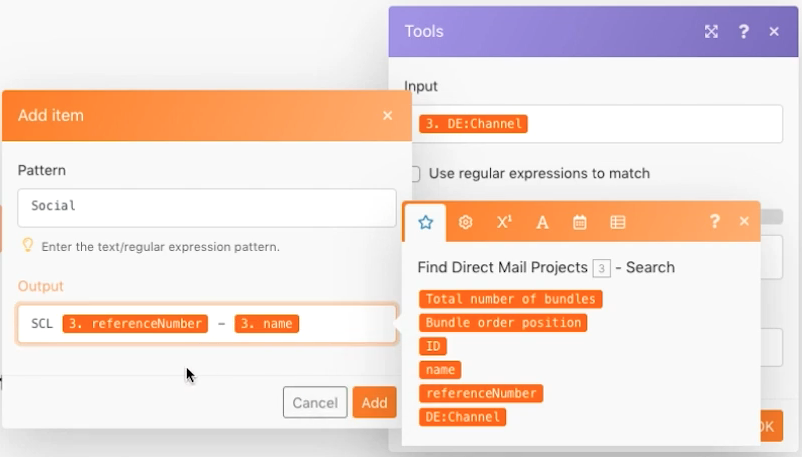

# Módulo de comutação

Entenda como usar o módulo Switch quando precisar executar transformações de dados mais complexas ou dinâmicas.

## Visão geral do exercício

Procure projetos de correspondência direta na unidade de teste e altere o nome de cada projeto com base em um valor selecionado em um campo personalizado anexado ao projeto.

## Etapas a serem seguidas

1. Crie um novo cenário e nomeie-o como &quot;Usando o módulo Switch&quot;.
1. Para o módulo acionador, use o módulo Workfront Search.
1. Configure sua conexão com o Workfront e defina o tipo de registro como Projeto.
1. Nos critérios de Pesquisa, especifique que deseja ver apenas os projetos que têm um valor no campo personalizado Canal.
1. Para saídas, selecione ID, Name, Reference Number e o campo personalizado Channel.

   

1. Adicione o módulo Switch em Ferramentas.
1. Para o campo de Entrada, mapeie o campo personalizado Canal do módulo de Pesquisa.

   

1. Em seguida, adicione casos para cada valor possível vindo do campo personalizado Channel. O valor possível vai para o campo Pattern. Você deseja que o campo de saída inclua um código específico de 3 letras seguido pelo número de referência do projeto e, em seguida, o nome do projeto.

   **Seu painel de mapeamento deve ter esta aparência:**

   

1. Você pode adicionar quantos casos adicionais desejar. Observe o campo Else na parte inferior. Isso será usado se o valor de entrada não corresponder a nenhum dos casos.

   **Atualize o nome do projeto no Workfront.**

   

1. Adicione um módulo Atualizar registro do Workfront.
1. No campo ID, mapeie para a ID do módulo do acionador.
1. Defina o Tipo de registro como Projeto.
1. Selecione o campo Nome na seção Selecionar campos a serem mapeados e mapeie-o para a saída do módulo Switch.
1. Salve o cenário e execute uma vez. Exibir os nomes de projeto atualizados na unidade de teste.
