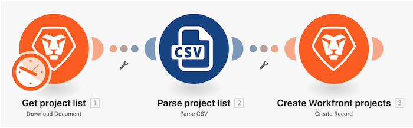

# Além do tutorial básico de mapeamento

Alterar o nome do projeto, a data inicial planejada e a prioridade do “Design de cenário inicial” criados no tutorial inicial usando as fórmulas do painel de mapeamento.

## Além do tutorial básico de mapeamento

O Workfront recomenda assistir ao tutorial em vídeo antes de tentar recriar o exercício em seu próprio ambiente.

>[!VIDEO](https://video.tv.adobe.com/v/335264/?quality=12&learn=on&enablevpops=1)

## Sua vez

>[!NOTE]
>
>Os exercícios práticos e desafios são opcionais e não são necessários para concluir o treinamento do Fusion.

Este exercício prático baseia-se no que você aprendeu no tutorial, mas a solução não é fornecida.

Repita as etapas do tutorial “Além do mapeamento básico” que você acabou de concluir. Você continuará usando esse cenário no próximo tutorial, portanto não o modifique neste exercício.

Crie uma tarefa em cada projeto criado como parte do tutorial anterior.

* Use “Planejamento inicial para um projeto (cor do projeto)” como o nome da tarefa.
* Defina a data inicial planejada utilizando a mesma data inicial planejada do projeto.
* Defina a duração como 3 dias e o tipo de duração como Atribuição calculada.
* Defina as horas planejadas como 10% da Classificação de confiança em horas.
* Defina a Restrição da tarefa como Assim que possível.

**Desafio:** se a cor do projeto for vermelha, atribua a tarefa a Rick Kuvec. Se a cor do projeto for amarela, atribua a tarefa a Mary Smith. Se a cor do projeto for verde, atribua a tarefa a Ida Blankenship.

## Quer saber mais? Recomendamos o seguinte:

[Documentação do Workfront Fusion](https://experienceleague.adobe.com/pt-br/docs/workfront-fusion/using/get-started-with-fusion/understand-workfront-fusion/workfront-fusion-overview)
