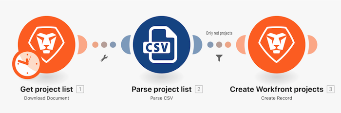

# Tutorial sobre filtros

Usando o exercício do tutorial “Além do mapeamento básico” criado anteriormente, adicione um filtro entre dois módulos para criar apenas projetos que tenham uma cor “vermelha” na lista de projetos.

## Tutorial sobre filtros

O Workfront recomenda assistir ao tutorial em vídeo antes de tentar recriar o exercício em seu próprio ambiente.

Neste vídeo, você aprenderá a:

* Adicionar um filtro entre dois módulos

>[!VIDEO](https://video.tv.adobe.com/v/335266/?quality=12&learn=on)

## Sua vez

>[!NOTE]
>
>Os exercícios práticos e desafios são opcionais e não são necessários para concluir o treinamento do Fusion.

Este exercício prático baseia-se no que você aprendeu no tutorial, mas a solução não é fornecida.

Modifique o filtro que você criou durante o tutorial dos filtros para permitir apenas projetos com a cor “amarela” e com uma classificação de confiança inferior a 100, ou que tenham a palavra “fase” no nome do projeto e uma data de início planejada para 2021. Nomeie o filtro como “Filtro de exercício prático”.

**Desafio:** tente criar um filtro que permita apenas projetos com uma classificação de confiança uniforme. Precisa de uma dica? Observe as fórmulas matemáticas.

## Quer saber mais? Recomendamos o seguinte:

[Documentação do Workfront Fusion](https://experienceleague.adobe.com/docs/workfront/using/adobe-workfront-fusion/workfront-fusion-2.html?lang=br)
