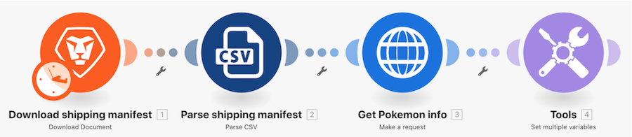

# Tutorial de introdução aos conectores universais

## Visão geral

Usando um caractere Pokemon em uma planilha, chame a API Poke por meio de um conector HTTP para coletar e publicar mais informações sobre esse caractere.

## Tutorial de introdução aos conectores universais

O Workfront recomenda assistir ao tutorial em vídeo antes de tentar recriar o exercício em seu próprio ambiente.

>[!VIDEO](https://video.tv.adobe.com/v/335270/?quality=12&learn=on&enablevpops=1)

### URLs de exercício

Site da API de Pokémon: `https://pokeapi.co/`

URL para o exercício: `https://pokeapi.co/api/v2/pokemon/{Character}`

## Quer saber mais? Recomendamos o seguinte:

[Documentação do Workfront Fusion](https://experienceleague.adobe.com/pt-br/docs/workfront-fusion/using/get-started-with-fusion/understand-workfront-fusion/workfront-fusion-overview)
