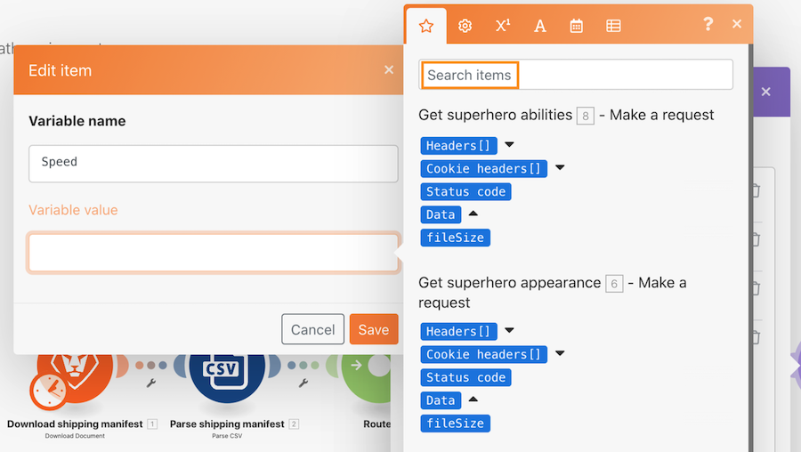
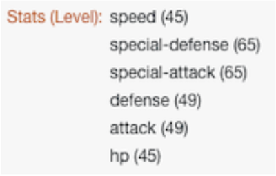

# Passo a passo dos roteadores

## Visão geral

Use um roteador para passar Pokemon vs. super-heróis empacota o caminho correto e, em seguida, crie uma tarefa para cada personagem.

## Passo a passo dos roteadores

A Workfront recomenda assistir ao vídeo de apresentação do exercício antes de tentar recriá-lo em seu próprio ambiente.

>[!VIDEO](https://video.tv.adobe.com/v/335272/?quality=12)

## URLs de exercício

* Site da API Superhero: `https://www.superheroapi.com/`
* Primeiro URL para exercício: `https://www.superheroapi.com/api/{access-token}/{character-id}/appearance`
* Segundo URL para exercício: `https://www.superheroapi.com/api/{access-token}/{character-id}/powerstats`

Se você tiver problemas para acessar seu próprio token de super-herói, poderá usar esse token compartilhado: 10110256647253588. Considere quantas vezes você chama a API de super-herói para que esse token compartilhado continue a funcionar para todos.

>[!TIP]
>
>Para obter instruções passo a passo sobre como concluir a apresentação, acesse o [Passo a passo dos roteadores](https://experienceleague.adobe.com/docs/workfront-learn/tutorials-workfront/fusion/exercises/routers.html?lang=en) exercício.

## Pesquisar itens no painel de mapeamento

O campo Search items na parte superior dos painéis de mapeamento ajuda a localizar rapidamente os campos no painel, mesmo que eles estejam aninhados em matrizes. A pesquisa não diferencia maiúsculas de minúsculas.

## Dicas e truques para trabalhar com APIs

Até agora, você trabalhou com uma API muito simples (Interface de programação de aplicativos) que não requer autenticação extra para obter as informações necessárias no cenário. Estas são algumas dicas para ajudar você a navegar trabalhando com APIs e conectores universais.

## Etapa 1: determine o tipo de API

O Workfront e muitos sistemas de software são criados usando uma API REST (Representational State Transfer, transferência de estado representacional), que é o tipo mais fácil e padrão de API atualmente. No entanto, há algumas outras, como:

* SOAP (Simple Object Access Protocol) (a API de prova do Workfront é baseada em SOAP)
* FTP (Protocolo de transferência de arquivo)
* SFTP (Protocolo de transferência segura de arquivo)
* Para saber mais, faça uma pesquisa na Web por tipos de API e palavras-chave de interesse.

>[!NOTE]
>
>Ao se conectar a plataformas maiores, como o Salesforce, diferentes áreas dessas plataformas fornecerão APIs diferentes. Certifique-se de encontrar o serviço correto para o qual você deseja se conectar.

## Etapa 2: determine o tipo de autenticação exigido pela API

A autenticação de API é uma forma de identificação usada para controlar o acesso a um serviço, como quando você tenta se conectar por meio do Workfront Fusion. Ele ajuda você a provar para outro sistema que está autorizado a acessar o sistema. O OAuth 2 é o tipo mais comum de autenticação usado atualmente. Saiba mais com uma pesquisa na Internet sobre autenticação de API.

A autenticação pode ser o aspecto mais difícil de trabalhar com uma API. Um dos recursos mais valiosos dos conectores universais do Workfront Fusion é que o Workfront Fusion pode lidar com a autenticação ao usar métodos de autenticação comuns, como OAuth 2, Chave de API e outros. Depois de criar uma conexão usando o módulo apropriado do Workfront Fusion para o seu método de autenticação (por exemplo, OAuth 2), o Workfront Fusion gerará continuamente chaves de API e/ou tokens sempre que você quiser executar o cenário.

Saiba mais sobre os diferentes tipos de autenticação que o Workfront fornece no artigo Visão geral de autenticação aprimorada no Experience League.

## Etapa 3: leia a documentação da API e encontre os endpoints necessários

Quando uma API interage com outro sistema, os pontos de contato dessa comunicação são considerados endpoints. Um endpoint é o local onde as APIs enviam solicitações e onde o recurso reside.

Ao interagir com uma API usando um conector universal, você precisa entender quais endpoints a API aceita e quais dados são necessários para cada solicitação. A documentação da API deve descrever os endpoints de uma API e como executar operações comuns, como criar, ler, atualizar ou excluir. A execução dessas chamadas requer prática, especialmente se você é novo em fazer chamadas de API ou em trabalhar com uma nova API.

Saiba mais sobre os Conectores Universais do Workfront Fusion e como configurá-los para se conectar com as APIs necessárias no Experience League.

## Nota final

Você pode verificar toda a lista de conectores de aplicativo pré-criados no Experience League. Se você quiser sugerir um novo conector de aplicativo para a equipe de produtos Workfront Fusion, envie sua ideia para o laboratório de inovação. Se você ainda não se submeteu, saiba mais sobre o Laboratório de Inovação, além de como votar em ideias e participar da priorização semestral do Placar de líderes. Se você já tiver acesso ao laboratório de inovação, faça logon e envie suas ideias.

## Sua vez

>[!NOTE]
>
>Exercícios práticos e desafios são opcionais e não são necessários para concluir o treinamento do Fusion.

Esse exercício de prática se baseia no que você aprendeu na apresentação, mas a solução não é fornecida.

No módulo Set multiple variables para caracteres Pokemon, crie uma variável chamada &quot;Stat (Level)&quot;. Mapeie o nome das estatísticas Pokemon para esta variável. Use a capacidade do valor da matriz para alterar a forma como a matriz é exibida, de modo que cada Estado seja uma nova linha, como mostrado abaixo.

**Dica:** Existem apenas seis diferentes estatísticas Pokemon com um nível correspondente.

**Desafio** Veja se você pode usar as fórmulas de matriz para obter as Habilidades para exibir da mesma forma que acima como linhas diferentes em vez de uma cadeia de valores separados por vírgula. Há uma dica na captura de tela abaixo.

## Quer saber mais? Recomendamos o seguinte:

[Documentação do Workfront Fusion](https://experienceleague.adobe.com/docs/workfront/using/adobe-workfront-fusion/workfront-fusion-2.html?lang=en)
