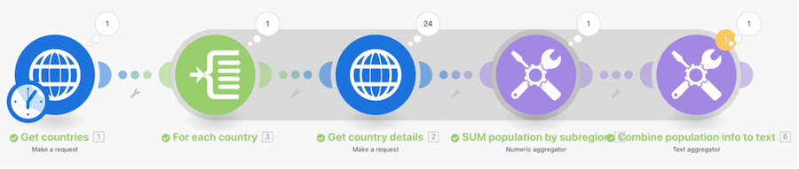

# Tutorial sobre agregação avançada

Chame um serviço da web para retornar detalhes sobre vários países e identificar a população total de todos os países, agrupada por sub-região.

## Tutorial sobre agregação avançada

O Workfront recomenda assistir ao tutorial em vídeo antes de tentar recriar o exercício em seu próprio ambiente.

>[!VIDEO](https://video.tv.adobe.com/v/335281/?quality=12&learn=on&enablevpops=1)

## URLs de exercício

* `https://restcountries.com/v2/lang/es`
* `https://restcountries.com/v2/name/{country name}`

## Reforço do princípio de agregação

Sempre que um módulo gera vários pacotes configuráveis, cada módulo posterior executará cada um dos pacotes.

Para evitar isso, adicione um agregador após um módulo que possa gerar vários pacotes configuráveis.

Você verá uma sombra ao redor dos segmentos do cenário, desde o **iterador inicial** até o **agregador final**. Isso ajuda a facilitar a localização desses segmentos no cenário do Workfront Fusion.

## Sua vez

>[!NOTE]
>
>Os exercícios práticos e desafios são opcionais e não são necessários para concluir o treinamento do Fusion.

Este exercício prático baseia-se no que você aprendeu no tutorial, mas a solução não é fornecida.

Crie um novo cenário para somar todas as horas registradas em tarefas nos projetos do portfólio de marketing. Em seguida, envie um email dizendo &quot;A equipe do projeto {Project Name} registrou {summed hours} do total de {planned hours} horas planejadas, colocando você em {percentage} do plano.&quot;

**Desafio:** tente fazer o mesmo, mas apenas para as horas registradas neste ano.

## Quer saber mais? Recomendamos o seguinte:

[Documentação do Workfront Fusion](https://experienceleague.adobe.com/pt-br/docs/workfront-fusion/using/get-started-with-fusion/understand-workfront-fusion/workfront-fusion-overview)
