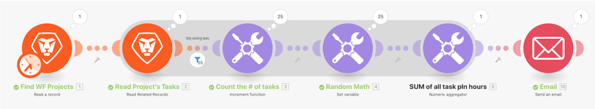

# Apresentação de agregação

## Visão geral

Usando o cenário “Introdução à iteração” que você criou no última exercício, agregue as horas planejadas em cada tarefa de trabalho do projeto e envie um email para si mesmo com essas informações.

## Apresentação de agregação

O Workfront recomenda assistir ao tutorial em vídeo antes de tentar recriar o exercício em seu próprio ambiente.

>[!VIDEO](https://video.tv.adobe.com/v/335280/?quality=12&learn=on&enablevpops=1)

## Quer saber mais? Recomendamos o seguinte:

[Documentação do Workfront Fusion](https://experienceleague.adobe.com/pt-br/docs/workfront-fusion/using/get-started-with-fusion/understand-workfront-fusion/workfront-fusion-overview)
