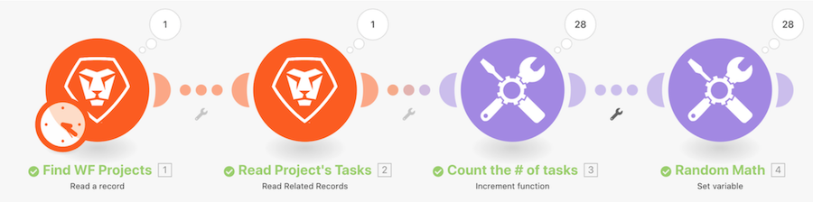

# Tutorial de introdução aos iteradores

Observe um projeto específico no Workfront e, em seguida, analise todas as tarefas desse projeto. Em seguida, você usará o módulo da ferramenta de incremento para contar o número de tarefas no projeto. Por fim, você usará o módulo da variável Definir para subtrair o Número de tarefas derivadas do Número de problemas abertos para produzir um valor numérico para cada um dos conjuntos de tarefas.

## Tutorial de introdução aos iteradores

O Workfront recomenda assistir ao tutorial em vídeo antes de tentar recriar o exercício em seu próprio ambiente.

>[!VIDEO](https://video.tv.adobe.com/v/335278/?quality=12&learn=on&enablevpops=1)

## Quer saber mais? Recomendamos o seguinte:

[Documentação do Workfront Fusion](https://experienceleague.adobe.com/en/docs/workfront-fusion/using/get-started-with-fusion/understand-workfront-fusion/workfront-fusion-overview)
