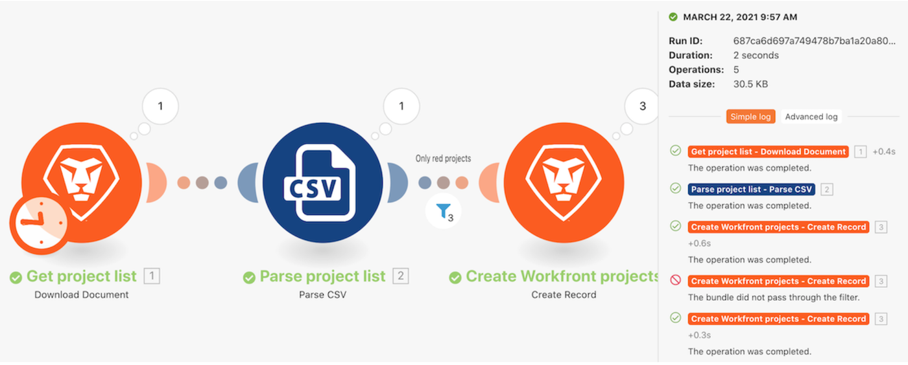
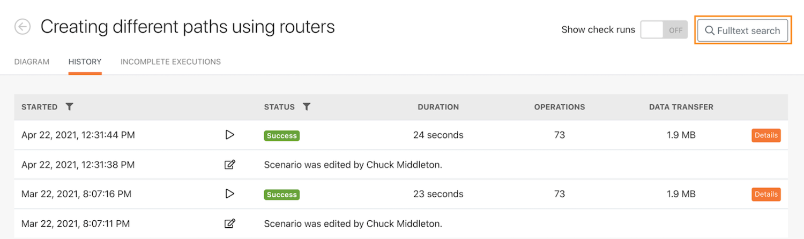
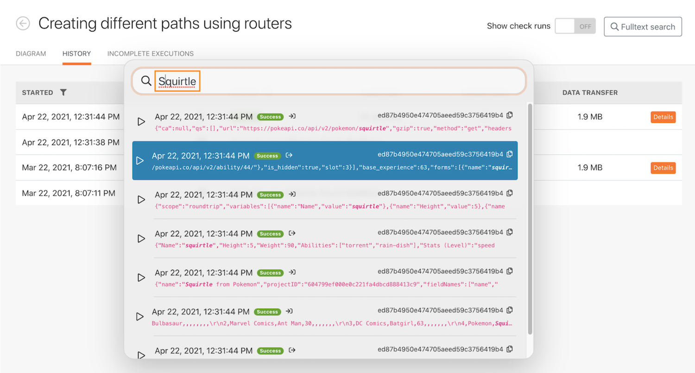
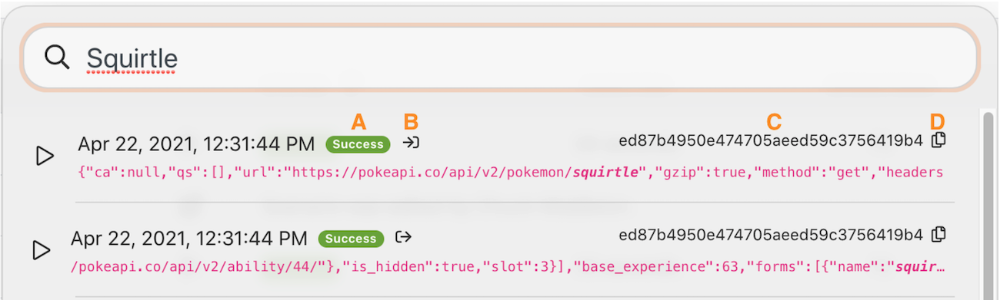
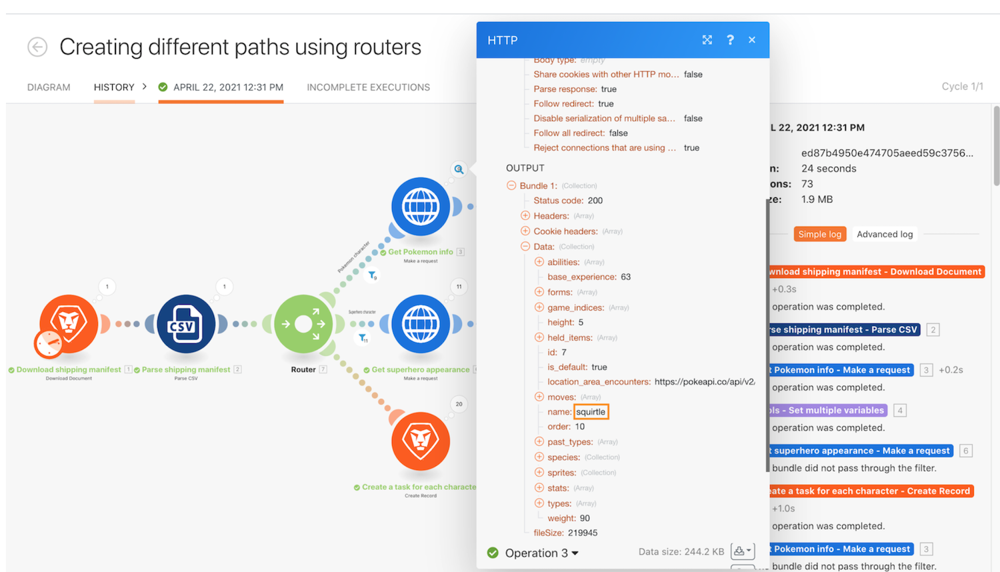

# Apresentação do histórico de execução

Revise o histórico de execução para o cenário “Uso do filtro poderoso” para entender o que aconteceu quando as execuções ocorreram e como elas foram estruturadas quando foram executadas.

## Apresentação do histórico de execução

O Workfront recomenda assistir ao tutorial em vídeo antes de tentar recriar o exercício em seu próprio ambiente.

>[!VIDEO](https://video.tv.adobe.com/v/335283/?quality=12&learn=on&enablevpops=1)

## Pesquisa de texto completo na guia histórico

A pesquisa de texto completo está disponível na guia histórico de um cenário, permitindo pesquisar quaisquer dados processados no cenário.

Em vez de abrir cada execução para pesquisar dados, a pesquisa de texto completo pesquisa todas as execuções em um único cenário. Os resultados da pesquisa fornecem uma lista de execuções em que os dados foram encontrados e você pode clicar em qualquer execução para explorar mais detalhadamente.

Os resultados da pesquisa contêm alguns ícones úteis na imagem abaixo.

A: O status da execução.

B: Se os dados estavam na entrada ou na saída do módulo em que foram encontrados.

C: A ID de execução.

D: Copiar a ID de execução.

Ao clicar em uma execução, o Workfront Fusion carrega a execução e o módulo onde o resultado da pesquisa foi encontrado. E abre o inspetor de execução no módulo que contém os dados de pesquisa.

## Quer saber mais? Recomendamos o seguinte:

[Documentação do Workfront Fusion](https://experienceleague.adobe.com/pt-br/docs/workfront-fusion/using/get-started-with-fusion/understand-workfront-fusion/workfront-fusion-overview)
