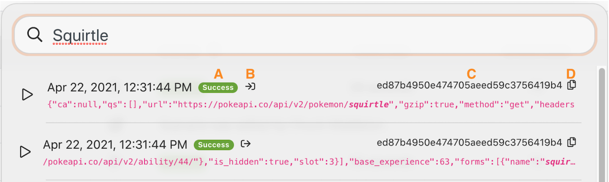

# Analise a apresentação do histórico de execução

## Visão geral

Revise o histórico de execução do cenário &quot;Uso do filtro de artigos&quot; para entender o que aconteceu quando as execuções ocorreram e como elas foram estruturadas quando foram executadas.

## Apresentação do histórico de execução

A Workfront recomenda assistir ao vídeo de apresentação de exercícios antes de tentar recriar o exercício em seu próprio ambiente.

>[!VIDEO](https://video.tv.adobe.com/v/335283/?quality=12)

>[!TIP]
>
>Para obter instruções passo a passo sobre como concluir a apresentação, acesse o [Apresentação do histórico de execução](https://experienceleague.adobe.com/docs/workfront-learn/tutorials-workfront/fusion/exercises/execution-history.html?lang=en) exercício.

## Pesquisa de texto completo na guia Histórico

A pesquisa de texto completo está disponível na guia histórico de um cenário, permitindo pesquisar por quaisquer dados processados no cenário.

Em vez de abrir cada execução para pesquisar dados, a pesquisa de texto completo pesquisa todas as execuções em um único cenário. Os resultados da pesquisa fornecem uma lista de execuções onde os dados foram encontrados e você pode clicar em qualquer execução para explorar mais.

Os resultados da pesquisa contêm alguns ícones úteis na imagem abaixo.

A—O status da execução.

B—Se os dados estavam na entrada ou na saída do módulo em que foram encontrados.

C—A ID de execução.

D—Copia a ID de execução.

Quando você clica em uma execução, o Workfront Fusion carrega a execução e o módulo onde o resultado da pesquisa foi encontrado. E ele abre o inspetor de execução no módulo que contém os dados de pesquisa.

## Quer saber mais? Recomendamos o seguinte:

[Documentação do Workfront Fusion](https://experienceleague.adobe.com/docs/workfront/using/adobe-workfront-fusion/workfront-fusion-2.html?lang=en)
