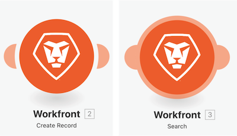

# Familiarize-se com aplicativos adicionais e módulos comuns

## Lembrete sobre tipos de módulo

### Módulos acionadores

Só podem ser usados como o primeiro módulo e podem retornar zero, um ou mais pacotes que serão processados individualmente em módulos subsequentes, a menos que sejam agregados.

* **Acionador instantâneo** (com um ícone de raio sobre Acionador): acionado imediatamente com base no webhook.
* **Acionador agendado** (com um ícone de relógio sobre Acionador): recursos especiais para acompanhar o último registro processado.

### Módulos de ações e pesquisa

* **Ação**: usado para executar operações CRUD (Criar, Ler, Atualizar e Excluir).
* **Pesquisas**: encontra zero, um ou mais registros e os retorna como pacotes que serão processados individualmente em módulos subsequentes, a menos que sejam agregados.

### Familiarize-se com aplicativos adicionais e módulos comuns

Neste vídeo, você aprenderá:

* O que são acionadores, ações e pesquisas e quais as diferenças
* Tipos de módulos encontrados em diferentes conectores de aplicativos e como eles funcionam

>[!VIDEO](https://video.tv.adobe.com/v/335287/?quality=12&learn=on)
