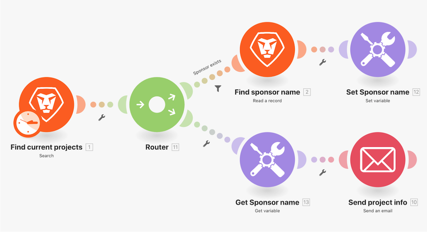

# Tutorial sobre a função Alternar

Para alterações simples de dados, use a função Alternar para transformar um valor de um campo de módulo em outro valor. Neste exercício, altere a chave de duas letras para o nome real do status do progresso do projeto enviado por email.

## Tutorial sobre a função Alternar

O Workfront recomenda assistir ao tutorial em vídeo antes de tentar recriar o exercício em seu próprio ambiente.

>[!VIDEO](https://video.tv.adobe.com/v/335289/?quality=12&learn=on&enablevpops=1)

## Quer saber mais? Recomendamos o seguinte:

[Documentação do Workfront Fusion](https://experienceleague.adobe.com/pt-br/docs/workfront-fusion/using/get-started-with-fusion/understand-workfront-fusion/workfront-fusion-overview)
