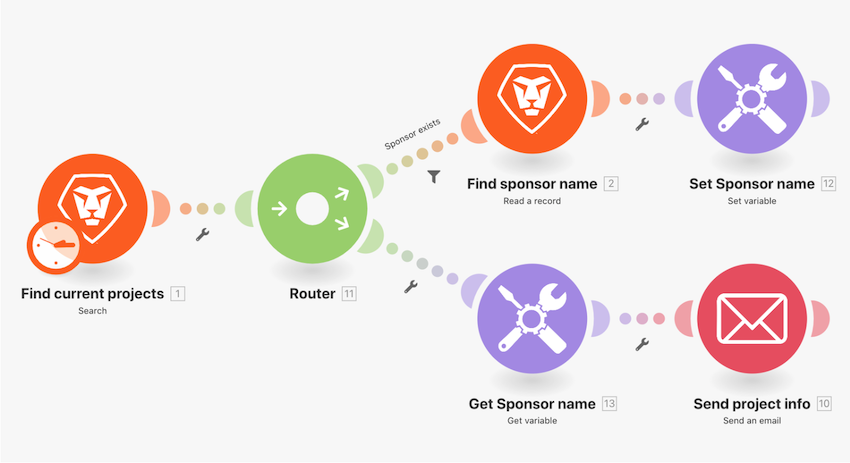

# Apresentação da função de comutador

## Visão geral

Para alterações de dados simples, use a função Switch para transformar um valor em outro dentro de um campo de módulo. Neste exercício, altere a chave de duas letras para o nome real do Status de progresso do projeto enviado em um email.

## Apresentação da função de comutador

A Workfront recomenda assistir ao vídeo de apresentação de exercícios antes de tentar recriar o exercício em seu próprio ambiente.

>[!VIDEO](https://video.tv.adobe.com/v/335289/?quality=12)

>[!TIP]
>
>Para obter instruções passo a passo sobre como concluir a apresentação, acesse o [Apresentação da função de comutador](https://experienceleague.adobe.com/docs/workfront-learn/tutorials-workfront/fusion/exercises/switch-function.html?lang=en) exercício.

## Quer saber mais? Recomendamos o seguinte:

[Documentação do Workfront Fusion](https://experienceleague.adobe.com/docs/workfront/using/adobe-workfront-fusion/workfront-fusion-2.html?lang=en)
