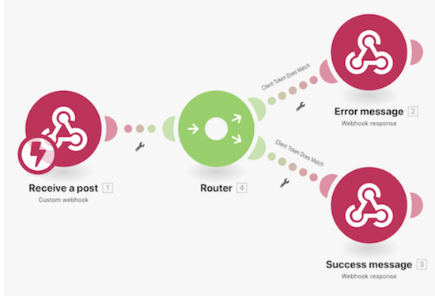
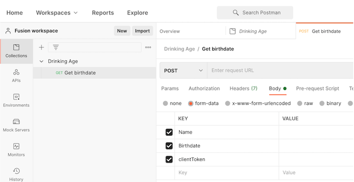

# Tutorial sobre webhooks

Este cenário cria um aplicativo de loja de conveniência para determinar com facilidade se um(a) cliente tem ou não idade suficiente para comprar bebidas alcoólicas. O(a) operador(a) do caixa precisa apenas informar o nome e a data de nascimento do(a) cliente ALÉM DE um token de cliente verificado para uma URL fornecida. Depois de inserido, isso acionará o cenário para calcular a resposta apropriada e retorná-la ao solicitante.

## Tutorial sobre webhooks

O Workfront recomenda assistir ao tutorial em vídeo antes de tentar recriar o exercício em seu próprio ambiente.

>[!VIDEO](https://video.tv.adobe.com/v/335292/?quality=12&learn=on&enablevpops=1)

## Configuração do Postman

Para acompanhar o exercício do tutorial, você precisa baixar o aplicativo gratuito Postman. Siga as etapas abaixo para navegar até a área correta do Postman para o exercício.

1. Crie um espaço de trabalho e abra-o.
1. Clique na guia Novo e crie uma nova coleção chamada Idade para beber.
1. Clique na guia Novo novamente e crie uma nova solicitação GET chamada GET data de nascimento.
1. Altere a ação de solicitação de GET para POST.
1. Acesse a área da subguia Corpo abaixo do campo URL da solicitação POST.
1. Escolha dados de formulário abaixo da subguia Autorização.
1. Crie três chaves para Nome, Data de nascimento e Token de cliente.

## Sua vez

>[!NOTE]
>
>Os exercícios práticos e desafios são opcionais e não são necessários para concluir o treinamento do Fusion.

Este exercício prático baseia-se no que você aprendeu no tutorial, mas a solução não é fornecida.

Crie um webhook do Workfront que aguarde a criação de novas atualizações e, em seguida, registre a data, o nome da pessoa que fez a atualização e o conteúdo da atualização. Envie essas informações para o seu email.

**Dica**: use o módulo acionador Monitoramento de eventos do Workfront para criar seu webhook. Além disso, no Workfront, as atualizações são chamadas de notas.

**Desafio**: você consegue localizar e adicionar a URL do local em que a atualização foi feita para facilitar o acesso?

## Quer saber mais? Recomendamos o seguinte:

[Documentação do Workfront Fusion](https://experienceleague.adobe.com/pt-br/docs/workfront-fusion/using/get-started-with-fusion/understand-workfront-fusion/workfront-fusion-overview)
