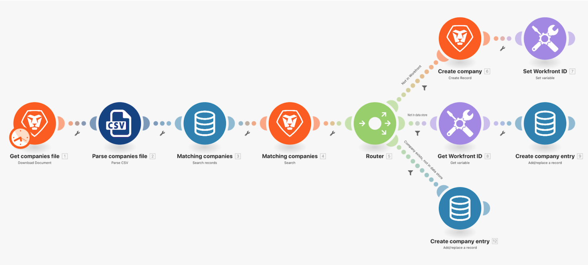

# Passo a passo sobre armazenamentos de dados

Neste exercício, estamos usando um armazenamento de dados para sincronizar nomes de empresas entre uma lista de empresas e o Workfront.

Isso faz parte de uma sincronização unidirecional de empresas no Workfront e algum outro sistema. Por enquanto, ele fará a sincronização apenas entre um arquivo CSV e o Workfront. Mas também manterá uma tabela num armazenamento de dados que acompanhará a ID do Workfront (WFID) e a ID da empresa no arquivo CSV (CID) de cada empresa. Isso nos permitirá tornar essa sincronização bidirecional em algum momento no futuro.

## Passo a passo sobre armazenamentos de dados

O Workfront recomenda assistir ao tutorial em vídeo antes de tentar recriar o exercício em seu próprio ambiente.

>[!VIDEO](https://video.tv.adobe.com/v/335296/?quality=12&learn=on&enablevpops=1)

## Observação final

Agora que você terminou de aprender sobre estruturas de dados e armazenamentos de dados, você pode estar se perguntando: “Quando devo usá-los?”

As estruturas de dados são mais comumente usadas para serializar ou analisar formatos de dados como JSON, XML, CSV e outros. As estruturas de dados oferecem a capacidade de controlar a estrutura dos seus dados e até mesmo validá-los. O motivo mais comum para se usar uma estrutura de dados é criar dados válidos para enviar a uma API que espera JSON ou XML. Nesses casos, é desejável usar o aplicativo JSON ou XML com a estrutura de dados para garantir que os dados estejam no formato correto.

Os armazenamentos de dados só devem ser usados para armazenar dados persistentes que precisam ser acessados por mais de uma execução de cenário. Por exemplo, você pode armazenar metadados sobre o último registro processado para casos de uso avançados que exigem controle preciso sobre o processamento.

Os armazenamentos de dados não foram projetados para serem usados como data warehouse ou registro. Os armazenamentos de dados não são acessíveis fora do Workfront Fusion e a maioria das interações com armazenamentos de dados ocorre por meio de um cenário do Workfront Fusion. Consequentemente, não é possível conectar um armazenamento de dados a uma ferramenta de análise ou de relatórios que seria esperada para casos de uso de data warehouse e registro. A função do Workfront Fusion em casos de uso como esses seria preencher um sistema apropriado para organizar e armazenar dados (por exemplo, SQL, MariaDB).

## Quer saber mais? Recomendamos o seguinte:

[Documentação do Workfront Fusion](https://experienceleague.adobe.com/pt-br/docs/workfront-fusion/using/get-started-with-fusion/understand-workfront-fusion/workfront-fusion-overview)
