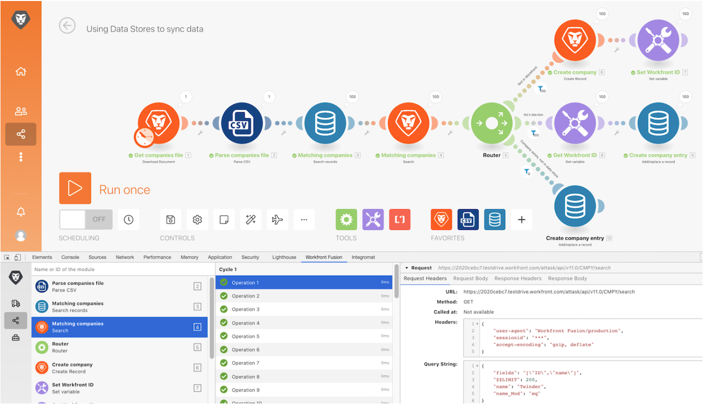

# Tutorial sobre a ferramenta de desenvolvimento

Instale e use as diferentes áreas da ferramenta de desenvolvimento do Workfront para entender melhor as solicitações e respostas feitas e aprender truques avançados de design de cenários.

## Tutorial sobre a ferramenta de desenvolvimento

O Workfront recomenda assistir ao tutorial em vídeo antes de tentar recriar o exercício em seu próprio ambiente.

>[!VIDEO](https://video.tv.adobe.com/v/335303/?quality=12&learn=on&enablevpops=1)

## Baixar a ferramenta de desenvolvimento

A ferramenta de desenvolvimento possui vários recursos avançados que melhoram sua capacidade de entender e solucionar problemas nos cenários. Baixe o documento “workfront-fusion-devtool.zip” encontrado na pasta Arquivos de exercícios do Fusion, na unidade de teste.

## Quer saber mais? Recomendamos o seguinte:

[Documentação do Workfront Fusion](https://experienceleague.adobe.com/pt-br/docs/workfront-fusion/using/get-started-with-fusion/understand-workfront-fusion/workfront-fusion-overview)
