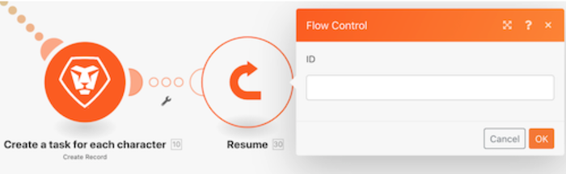
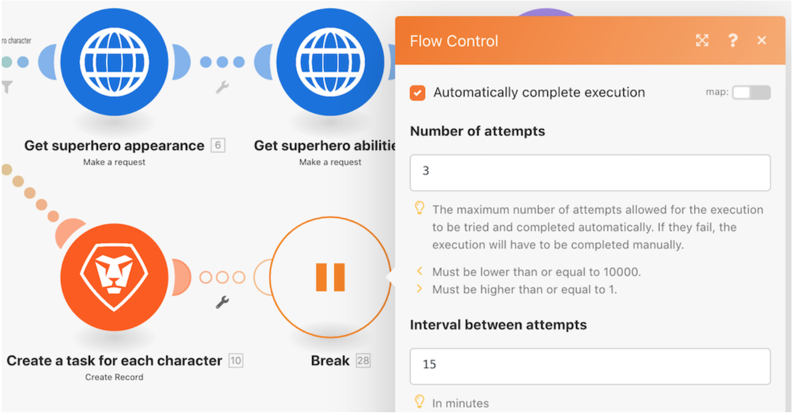
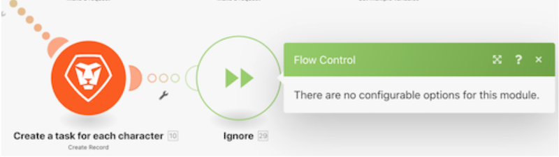
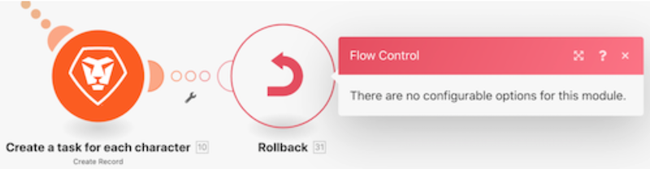

# Entenda as diretivas de manipulação de erros

Neste vídeo, você aprenderá:

* As três diretivas do manipulador de erros que permitem que a execução continue
* As duas diretivas do manipulador de erros que interrompem a execução

>[!VIDEO](https://video.tv.adobe.com/v/335305/?quality=12&learn=on&enablevpops=1)

## Diretivas - O cenário continua

### Retomar

* Uma saída substituta é especificada e fornecida ao módulo que encontra um erro.
* Os módulos subsequentes são processados.
* O status de execução do cenário é marcado como “sucesso”.

### Interrupção

* O estado de execução do cenário é armazenado na fila de execuções incompletas, onde o erro pode ser resolvido manualmente. No entanto, existem algumas exceções que são mencionadas aqui.
* Os módulos subsequentes não são processados.
* Se houver pacotes não processados, a execução do cenário continuará normalmente.
* O status de execução do cenário é marcado como “aviso”.

### Ignorar

* O erro é ignorado e os módulos subsequentes não são processados.
* Se houver pacotes não processados, a execução do cenário continuará normalmente.
* O status de execução do cenário é marcado como “sucesso”.

## Diretivas - Interrupções de cenário

### Reversão

* A execução do cenário é interrompida imediatamente e uma fase de reversão é iniciada em todos os módulos, na tentativa de revertê-los ao seu estado inicial.
* Os módulos subsequentes não são processados.
* Exceto no caso de alguns tipos de erros, o cenário é desativado após o “número de erros consecutivos” especificado nas Configurações do cenário.
* O status de execução do cenário é marcado como “erro”.

>[!NOTE]
>
>Este é o comportamento padrão se nenhuma rota do manipulador de erros estiver anexada ao módulo e a configuração “Permitir armazenamento de execuções incompletas” não estiver marcada nas Configurações do cenário.

### Confirmar

* O erro é ignorado e os módulos subsequentes não são processados.
* Se houver pacotes não processados, a execução do cenário continuará normalmente.
* O status de execução do cenário é marcado como “sucesso”.

