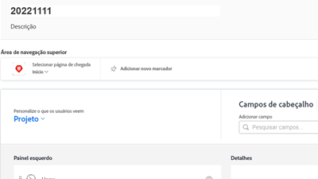
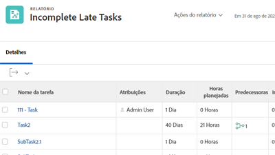

# Workfront Tutorials {#overview}

Uma biblioteca de vídeos e artigos de treinamento criada para ajudá-lo a entender melhor os recursos e as configurações do Workfront.  Está incluído um conjunto de práticas recomendadas, exercícios com curadoria e outros recursos que ajudarão você e sua organização a ter sucesso com o Workfront.

>[!VIDEO](https://video.tv.adobe.com/v/335063/?quality=12)

<!-- 

This is the landing page of the user guide. It should be the first list item in the TOC.md file. 
See other user landing pages to get ideas. 

-->

## Novidades?

Explore as atualizações mais recentes feitas nos tutoriais para cada versão de produto do Workfront. Veja o que foi atualizado com a versão mais recente:

* O ícone de favoritos e recentes foi separado na navegação superior do Workfront. Um breve resumo de cada uma pode ser encontrado no <a href="/help/manage-work/projects/find-projects.md">Procurar Projetos</a> tutorial.

* Configure um formulário personalizado para trabalhar com vários tipos de objeto. Veja como na <a href="/help/custom-data/custom-forms/custom-forms-creating-and-sharing-a-custom-form.md">criar e compartilhar um formulário personalizado</a> tutorial.

## Escolhas de pessoal

<table style="margin-top: 0 !important">
  <tr>
   <td>
      
      

         <a href="/help/administration-and-setup/layout-templates/find-layout-templates.md"><strong>Localizar e criar modelos de layout</strong></a>
      

      

         <em>Saiba como criar um modelo básico de layout.</em>
      

    </td>
   <td>
      
      

         <a href="/help/manage-work/issues-requests/make-a-request.md"><strong>Fazer uma solicitação</strong></a>
      

      

         <em>Saiba como fazer, exibir e editar solicitações.</em>
      

<td>
      
      

         <a href="/help/reporting/basic-reporting/create-a-simple-report.md"><strong>Criar um relatório simples</strong></a>
      

      

         <em>Saiba como criar um relatório personalizado simples.</em>
      

    </td>
  </tr>
</table>

