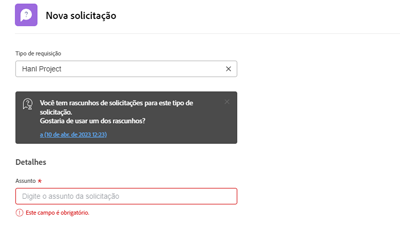

# Workfront Tutorials {#overview}

Uma biblioteca de vídeos e artigos de treinamento projetada para ajudá-lo a entender melhor os recursos e as configurações do Workfront.  Inclui uma coleção de práticas recomendadas, exercícios preparados e outros recursos que ajudarão você e sua organização a ter sucesso com o Workfront.

>[!VIDEO](https://video.tv.adobe.com/v/335063/?quality=12)

<!-- 

This is the landing page of the user guide. It should be the first list item in the TOC.md file. 
See other user landing pages to get ideas. 

-->

## O que há de novo?

Explore as atualizações mais recentes feitas nos tutoriais para cada versão de produto do Workfront. Veja o que foi atualizado com a versão mais recente:

* Os favoritos e os recentes ícones foram separados na navegação superior no Workfront. Um breve resumo de cada um pode ser encontrado no <a href="/help/manage-work/projects/find-projects.md">Localizar Projetos</a> tutorial.

* Configure um formulário personalizado para funcionar com vários tipos de objeto. Veja como na <a href="/help/custom-data/custom-forms/custom-forms-creating-and-sharing-a-custom-form.md">criar e compartilhar um formulário personalizado</a> tutorial.

## Pessoal

<table>
  <tr>
   <td>
      
      

         <a href="/help/administration-and-setup/layout-templates/find-layout-templates.md"><strong>Localizar e criar modelos de layout</strong></a>
<!----          <em>foo</em> --->
      

      

         
         Saiba como criar um modelo básico de layout.
      

    </td>
   <td>
      
      

         <a href="/help/manage-work/issues-requests/make-a-request.md"><strong>Fazer uma solicitação</strong></a>
<!----          <em>foo</em> --->
      

      

       
         Saiba como fazer, exibir e editar solicitações.
      

<td>
      
      

         <a href="/help/reporting/basic-reporting/create-a-simple-report.md"><strong>Criar um relatório simples</strong></a>
<!----          <em>foo</em> --->
      

      

         
         Saiba como criar um relatório personalizado simples.
      

    </td>
  </tr>
</table>
