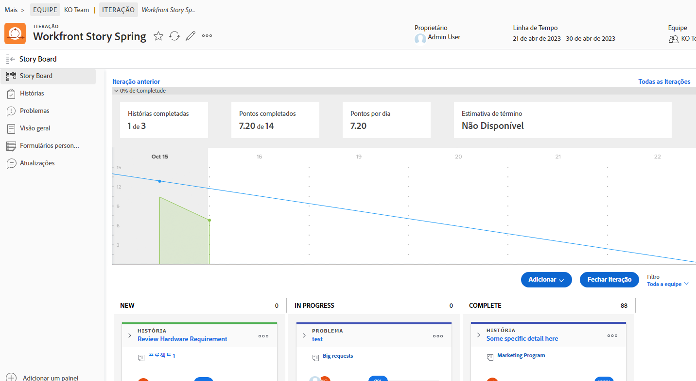
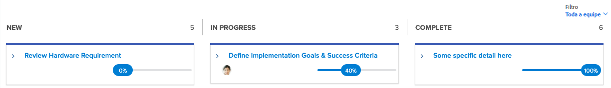

# Crie visibilidade com o [!DNL Jira] Integração

[!DNL Jira]  é um produto usado para rastrear projetos e problemas de equipes de desenvolvimento e suporte técnico. Embora muitas equipes usem Jira para rastrear o progresso no nível da tarefa, elas usam [!DNL Workfront] para fazer um verdadeiro gerenciamento de projetos, pois eles podem obter uma visualização de progresso de alto nível. Com o [!DNL Jira]  integração nativa, essas informações podem ser automaticamente transferidas entre os dois aplicativos.

## O que é [!DNL Jira] ?

[!DNL Jira]  é um produto criado por [!DNL Atlassian] acompanhar projetos e problemas para equipes de desenvolvimento e suporte técnico. Muitas equipes usam [!DNL Jira]  para rastrear o progresso no nível da tarefa, mas também usam [!DNL Workfront] para gerenciar projetos. Isso significa que as equipes duplicam seus esforços criando tarefas em [!DNL Workfront] e [!DNL Jira] . Ainda com o [!DNL Jira]  integração nativa, esse tipo de informação pode ser automaticamente transferida entre os dois aplicativos.

## O que pode uma [!DNL Jira]  integração?

Aqui temos uma foto [!DNL Workfront] com título &quot;[!DNL Workfront] Primavera da História.&quot;

Joan Harris, chefe da equipe do Conselho Dev-Jedi Agile, usa o painel de controle e o gráfico de intermitência como forma de medir o progresso do gráfico geral. Ele dá à equipe uma representação visual legal do que está acontecendo. Além disso, essas informações estão sendo inseridas em um relatório executivo que é revisado a cada trimestre. No entanto, a maioria da equipe faz as atualizações no [!DNL Jira] , não [!DNL Workfront].

A equipe de Joan tem usado [!DNL Jira]  por vários anos e achar que é uma boa maneira para eles rastrearem tarefas individuais e/ou bugs que foram atribuídos ao trabalho. Mas a Joan precisa realmente dessa informação para se conectar [!DNL Workfront] e, em última análise, alimentar esses relatórios executivos.

Por meio da [!DNL Jira]  integração nativa, qualquer atualização feita em tarefas, histórias ou bugs pode atualizar automaticamente tarefas, histórias e/ou problemas em [!DNL Workfront].

Assim, quando o membro da equipe atribuído ao artigo Revisar Requisito de Hardware faz uma atualização para o status em [!DNL Jira] , movendo-a de &quot;Novo&quot; para &quot;Em Andamento&quot;, essa atualização alterará automaticamente o status da história em [!DNL Workfront] também.

