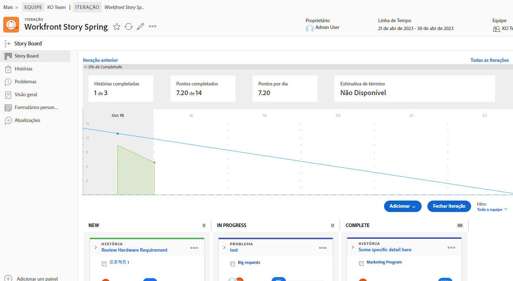
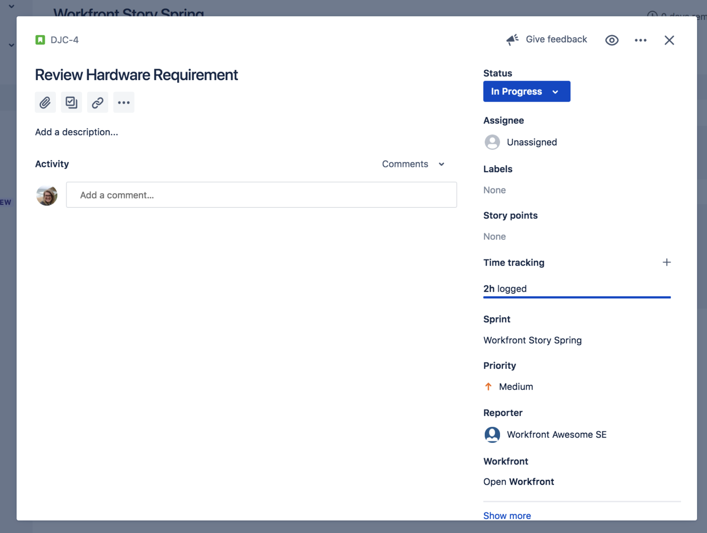
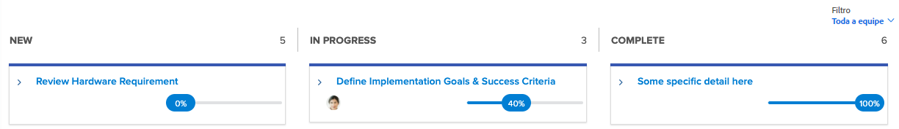

# Criar visibilidade com a integração do [!DNL Jira]

O [!DNL Jira] é um produto usado para monitorar projetos e problemas para equipes de desenvolvimento e suporte técnico. Embora muitas equipes usem o Jira para monitorar o progresso em nível de tarefa, elas usam o [!DNL Workfront] para realizar um gerenciamento efetivo de projetos, pois ele oferece uma visão mais detalhada do progresso. Com a integração nativa do [!DNL Jira], essas informações podem ser transferidas automaticamente entre os dois aplicativos.

## O que é o [!DNL Jira]?

O [!DNL Jira] é um produto criado pela [!DNL Atlassian] para que equipes de desenvolvimento e suporte técnico possam monitorar projetos e problemas. Muitas equipes usam o [!DNL Jira] para monitorar o progresso em nível de tarefa, mas também usam o [!DNL Workfront] para gerenciar projetos. Isso representa um esforço duplicado, pois é necessário criar tarefas no [!DNL Workfront] e no [!DNL Jira]. No entanto, com a integração nativa do [!DNL Jira], esse tipo de informação pode ser transferido automaticamente entre os dois aplicativos.

## Como instalar o Adobe Workfront para Jira?

Acesse [Adobe Workfront para Jira](https://experienceleague.adobe.com/docs/workfront/using/adobe-workfront-integrations/workfront-for-jira/workfront-for-jira.html?lang=pt-BR) para saber como instalar e configurar o Adobe Workfront para Jira.

## O que a integração com o [!DNL Jira] pode fazer?

Aqui temos um sprint do [!DNL Workfront] intitulado “História de abertura do [!DNL Workfront]”.

Joan Harris, líder da equipe Ágil do conselho para desenvolvedores Jedi, usa o quadro de scrum e o gráfico de burndown para medir o progresso de sprint geral. Isso proporciona à equipe uma representação visual clara do que está acontecendo. Além disso, essas informações são inseridas em um relatório executivo que é revisado trimestralmente. No entanto, a maioria das equipes atualiza seus dados no [!DNL Jira], não no [!DNL Workfront].

A equipe de Joan tem usado o [!DNL Jira] há vários anos e o consideram um bom recurso para acompanhar tarefas individuais e/ou falhas nas quais precisam trabalhar. Mas Joan precisa dessa informação para se conectar ao [!DNL Workfront] e, por fim, gerar esses relatórios executivos.

Através da integração nativa do [!DNL Jira], todas as alterações feitas em tarefas, histórias ou falhas são atualizadas automaticamente no [!DNL Workfront].

Assim, quando o membro da equipe atribuído à história Revisar requisito de hardware fizer uma atualização de status no [!DNL Jira], alterando-a de “Novo” para “Em andamento”, isso também atualizará automaticamente o status da história no [!DNL Workfront].

