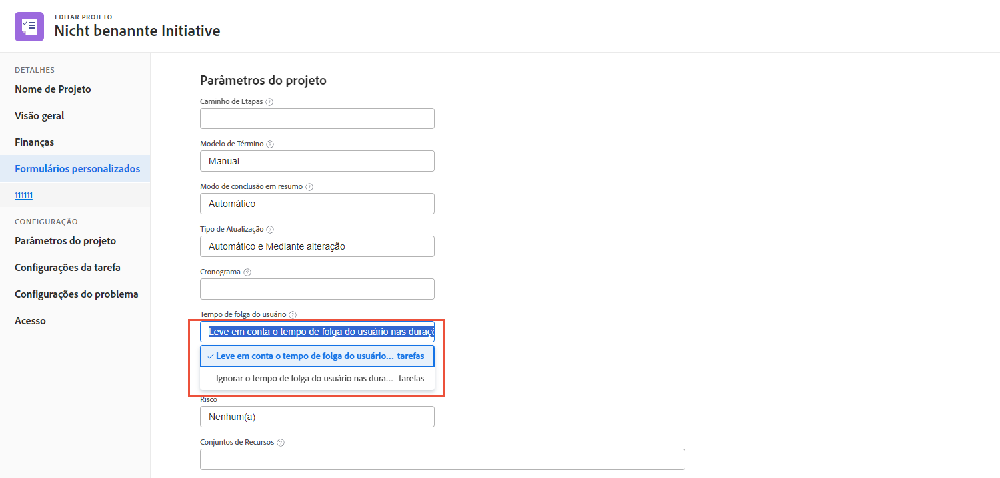
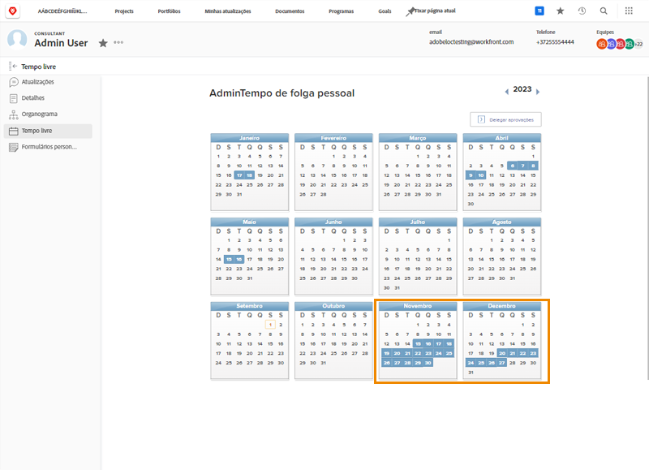
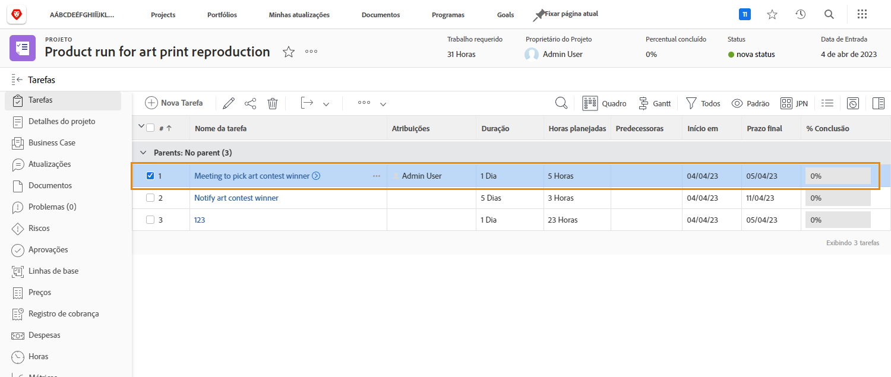
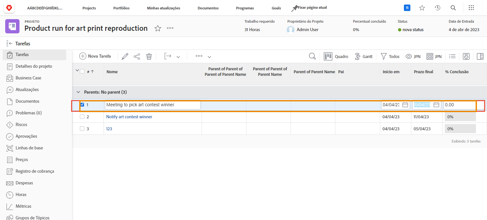
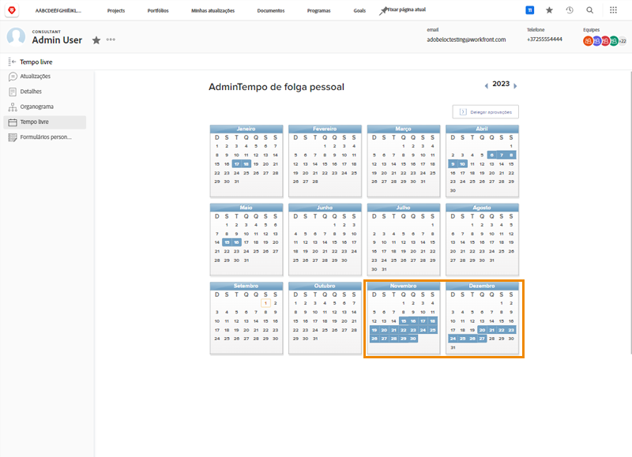
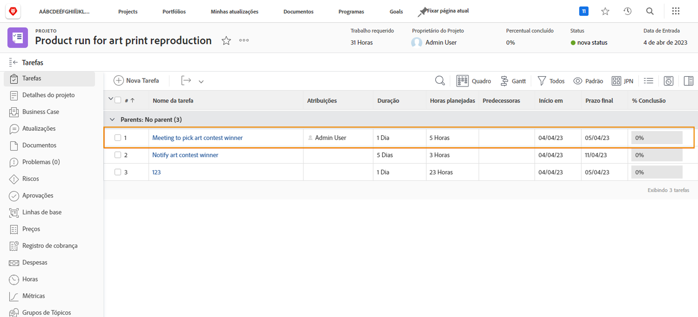
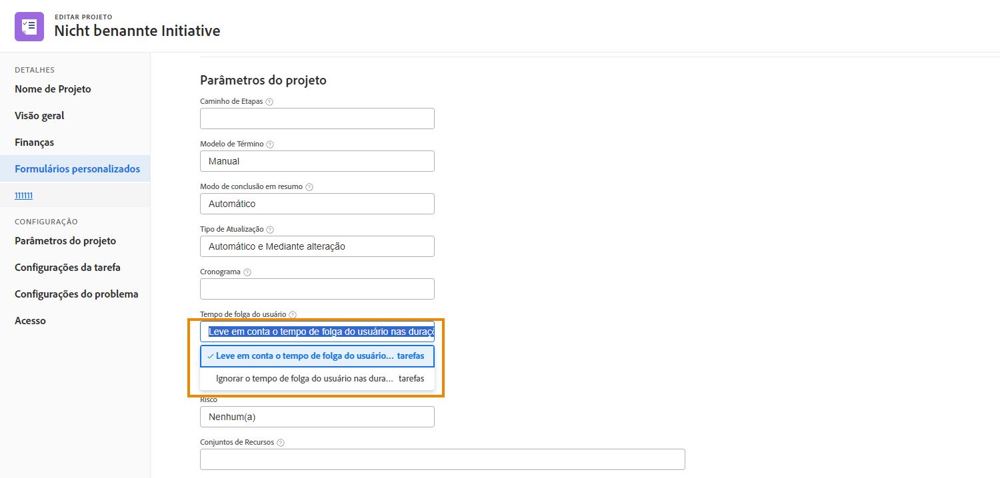

# Como o tempo limite afeta as linhas do tempo do projeto

Se o tempo de folga de um usuário atribuído na linha do tempo do projeto depende de uma configuração de projeto chamada [!UICONTROL Tempo do usuário desligado]. Essa configuração determina se o tempo limite do destinatário principal da tarefa ajusta as datas planejadas para essa tarefa no projeto.

Vamos ver o que acontece com uma linha do tempo do projeto quando cada uma das configurações é selecionada—C[!UICONTROL considerar o tempo limite do usuário nas durações da tarefa] ou [!UICONTROL Ignorar tempo limite do usuário nas durações da tarefa].

## Leve em conta o tempo de folga do usuário nas durações de tarefas

Essa opção é a configuração padrão do Workfront.

Neste exemplo, o destinatário principal da tarefa tem dias de folga marcados em seu calendário pessoal.

O gerente de projeto deseja atribuir essa pessoa a uma tarefa que tem datas planejadas que se sobrepõem ao tempo de folga do usuário.

Quando este usuário é atribuído à tarefa, as datas planejadas se ajustam automaticamente. Agora, a data de conclusão planejada da tarefa foi estendida por vários dias para acomodar o tempo de folga do usuário. É importante observar que essa alteração pode afetar as datas planejadas de outras tarefas no projeto e, potencialmente, a data de conclusão planejada do projeto.

## [!UICONTROL Ignorar o tempo de folga do usuário nas durações de tarefas]

Com essa opção, as datas planejadas da tarefa permanecem como originalmente planejadas, mesmo que o destinatário principal tenha tempo de folga durante a duração dessa tarefa.

O membro da equipe tem dias de folga marcados em seu calendário.

O gerente de projeto atribui a eles uma tarefa que se sobrepõe ao tempo limite. Depois que o usuário é atribuído, as datas planejadas da tarefa permanecem como originalmente planejadas.

Para garantir que o trabalho seja feito a tempo, pode ser útil atribuir outra pessoa que possa trabalhar na tarefa enquanto o destinatário original estiver fora do escritório.

## Ajuste a configuração no nível do projeto

Para alterar a configuração Tempo limite do usuário em um projeto:

* Abra o projeto clicando no nome no Workfront.

* Selecionar [!UICONTROL Editar] no menu de 3 pontos no cabeçalho da página, à direita do nome do projeto.

* Role para [!UICONTROL Configurações do projeto] e localize a [!UICONTROL Tempo do usuário desligado] campo.

* Selecione a opção que deseja aplicar a este projeto — [!UICONTROL Considere o tempo limite do usuário nas durações da tarefa] ou I[!UICONTROL Ignorar o tempo limite do usuário nas durações da tarefa].

* Clique no botão [!UICONTROL Salvar] no canto superior direito da janela.

**Observação**: Esta configuração não está disponível ao selecionar [!UICONTROL Detalhes do projeto] no menu do painel esquerdo da página do projeto.

Uma configuração global para isso existe nas preferências do projeto no [!UICONTROL Configuração] menu. Esta configuração é gerenciada pelo administrador do sistema. Os administradores de grupo podem ajustar essa configuração para os grupos que gerenciam.

A Workfront recomenda definir a configuração da maneira como você deseja que a maioria dos projetos controle o tempo de folga em sua organização.

A configuração também pode ser incorporada nos modelos do projeto, por meio dos detalhes do modelo.
