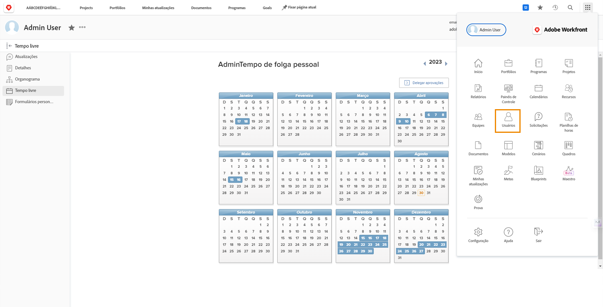

# Gerenciar o tempo de folga de outro usuário

Os gerentes ou outros líderes podem gerenciar os calendários de folga dos membros da equipe se tiverem permissões de Edição de usuário atribuídas por meio de seu nível de acesso ao Workfront. Os níveis de acesso são criados e atribuídos pelos administradores de sistema da Workfront.

A Workfront recomenda que sua organização tenha uma política ou procedimento para quando um gerente atualizar o calendário de folga pessoal de um funcionário.

Para gerenciar o calendário de outro usuário:

* Clique em [!UICONTROL Menu principal] e selecione Usuários.

* Use o ícone de pesquisa para localizar o usuário ou percorrer a lista.

* Clique no nome do usuário na lista.

* Clique em [!UICONTROL Folga] no menu do painel esquerdo na página perfil do usuário.

* Clique em uma data no calendário.

* A Workfront presume um dia de folga completo. Se esse for o caso, clique em [!UICONTROL Salvar] botão.

* Para vários dias consecutivos de folga, altere a data Para para o último dia fora do escritório. Clique em [!UICONTROL Salvar] botão.

* Se estiver marcando um dia de folga parcial, desmarque a opção [!UICONTROL O dia todo] caixa. Em seguida, indique as horas que o usuário trabalhará nesse dia (as horas em que estão disponíveis). Clique em [!UICONTROL Salvar] botão.
