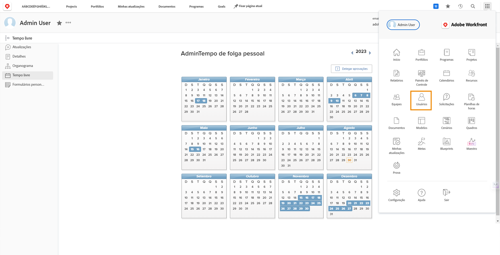

# Gerenciar as folgas de outros usuários

Gerentes e líderes podem gerenciar os calendários de folga dos membros da equipe se receberem permissões de edição de usuário em seu nível de acesso do Workfront. Os níveis de acesso são criados e atribuídos por admins de sistema do Workfront.

O Workfront recomenda que sua organização tenha uma política ou procedimento para quando gerentes atualizam o calendário de folgas de um funcionário.

Para gerenciar o calendário de outro usuário:

* Clique no [!UICONTROL Menu principal] e selecione Usuários.

* Use o ícone de pesquisa para localizar o usuário ou percorra a lista.

* Clique no nome do usuário na lista.

* Clique em [!UICONTROL Folga] no menu do painel esquerdo da página de perfil do usuário.

* Clique em uma data no calendário.

* O Workfront pressupõe um dia inteiro de folga. Se for esse o caso, clique no botão [!UICONTROL Salvar].

* Para vários dias de folga consecutivos, altere a data “Até” para o último dia que o usuário não estará trabalhando. Clique no botão [!UICONTROL Salvar].

* Se estiver marcando um dia de folga parcial, desmarque a opção [!UICONTROL O dia todo]. Em seguida, indique os horários em que o usuário trabalhará naquele dia (os horários em que estará disponível). Clique no botão [!UICONTROL Salvar].
