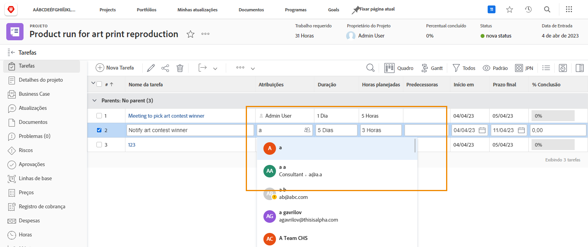
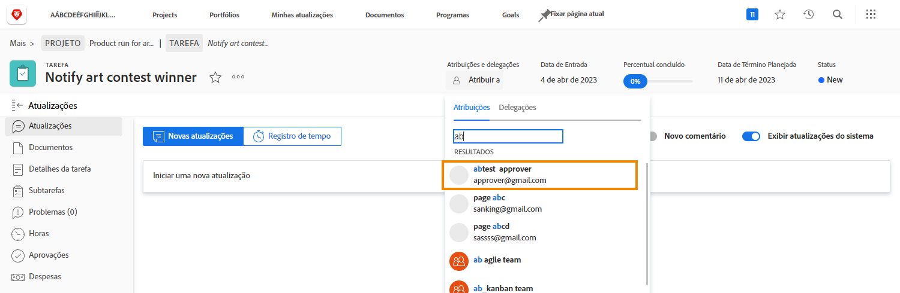

# Consulte folga ao atribuir tarefas

Um ícone pequeno indica que um usuário tem uma folga marcada em seu calendário pessoal durante a duração da tarefa, quando você está atribuindo usuários.

Ao atribuir do plano de projeto digitando o nome de um usuário, você vê o nome dele esmaecido e um pequeno ícone de aviso azul ao lado da imagem do avatar.

Se estiver fazendo uma atribuição a partir do cabeçalho da página de tarefas, você verá um pequeno ícone de avião azul ao lado do avatar da pessoa para alertá-lo de que ela tem uma folga durante a duração dessa tarefa.

