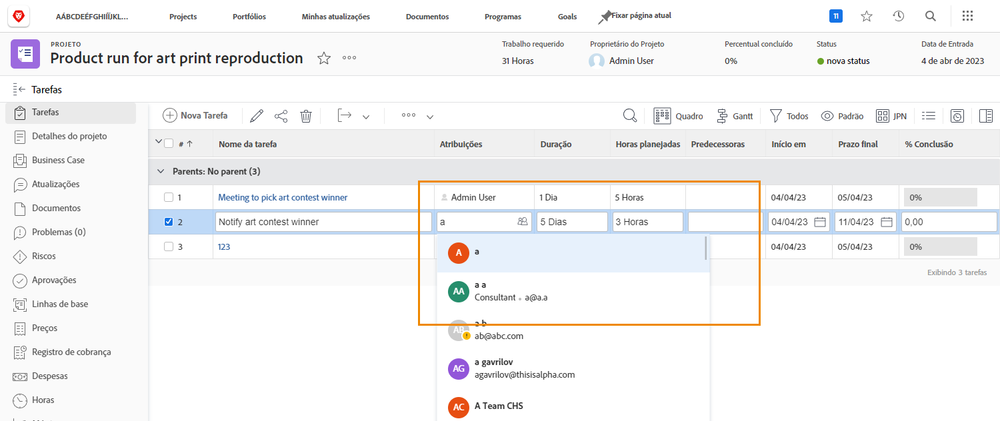
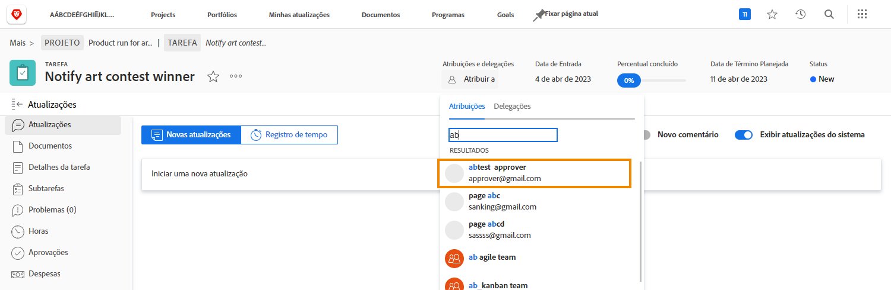

# Veja as folgas ao atribuir tarefas

Um pequeno ícone indica que um usuário tem folga marcada em seu calendário pessoal durante a tarefa quando você está atribuindo usuários.

Ao atribuir a partir do plano do projeto, digitando o nome de um usuário, você verá o nome dele esmaecido e um pequeno ícone de aviso azul próximo à imagem do avatar.

Se você estiver atribuindo a partir do cabeçalho da página de tarefas, verá um pequeno ícone de avião azul próximo ao avatar da pessoa para alertar que ela terá uma folga durante a tarefa.

