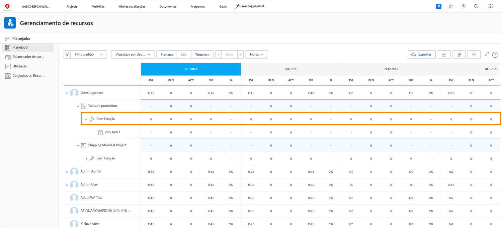
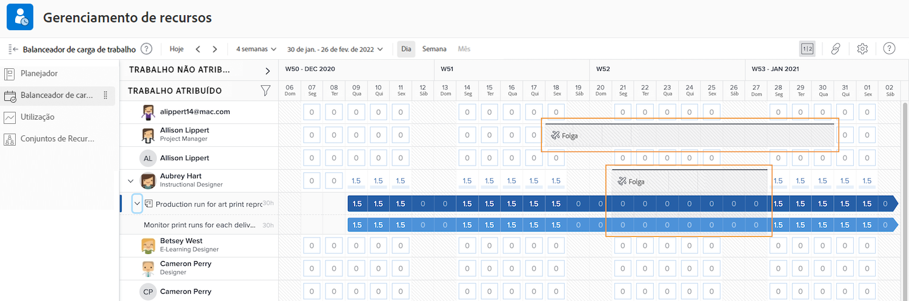

# Visibilidade nas ferramentas de gerenciamento de recursos

Saber quem está disponível e quando é vital para o planejamento e o gerenciamento de recursos. Quando os usuários marcam sua hora pessoal no calendário no Workfront, essa informação também pode ser vista nas ferramentas de recursos do Workfront.

## Planejador de recursos

O tempo de folga de um usuário é refletido na coluna Disponível (AVL) no planejador de recursos. O Workfront subtrai o tempo de folga marcado em seu calendário do tempo disponível, conforme calculado pela Workfront com base no agendamento atribuído, na porcentagem de função de trabalho etc.

## Balanceador de carga de trabalho

No Balanceador de Carga de Trabalho, o tempo limite aparece como barras cinza no calendário. Essa visibilidade ajuda os gerentes de recursos e outras pessoas a tomarem decisões mais informadas ao atribuir trabalho.

No entanto, o indicador de tempo limite não impede que o trabalho seja atribuído ao usuário por meio do Balanceador de Carga de Trabalho. Se o trabalho for atribuído, o Balanceador de Carga de Trabalho mostrará que a pessoa está sobrealocada durante o período de folga.

