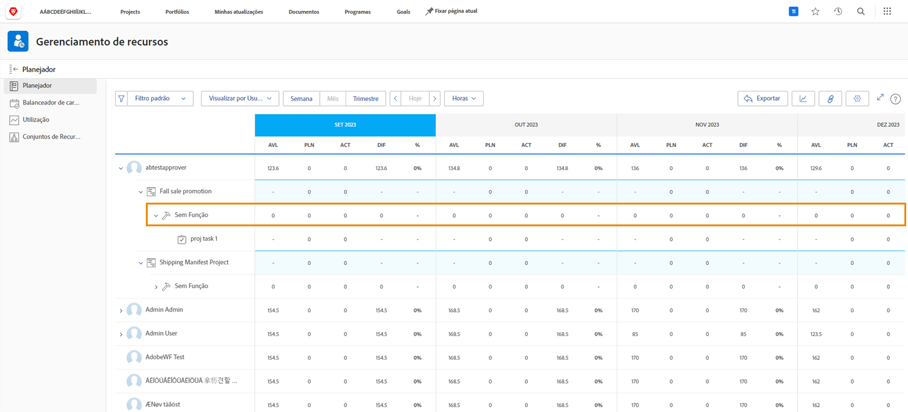
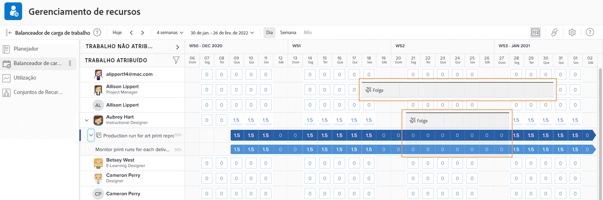

# Visibilidade em ferramentas de gerenciamento de recursos

Sabendo quem está disponível e quando é vital para o planejamento e gerenciamento de recursos. Quando os usuários marcam seu horário pessoal no calendário do Workfront, essas informações também podem ser vistas nas ferramentas de recursos do Workfront.

## Planejamento de recursos

A folga de um usuário é refletida na coluna “Disponível (DISP.)” do planejador de recursos. O Workfront subtrai o tempo de folga marcado em seu calendário do tempo disponível, conforme calculado pelo Workfront com base na programação atribuída, porcentagem de função no trabalho etc.

## Balanceador de carga de trabalho

No Balanceador de Carga de trabalho, a folga aparece como barras cinzas no calendário. Essa visibilidade ajuda os gerentes de recursos e outras pessoas a tomarem decisões mais fundamentadas ao atribuir trabalhos.

No entanto, o indicador de folga não impede que o trabalho seja atribuído ao usuário por meio do Balanceador de carga de trabalho. Se o trabalho for atribuído, o Balanceador de carga de trabalho mostrará que a pessoa está superalocada durante o período de folga.

