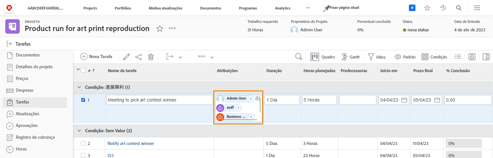
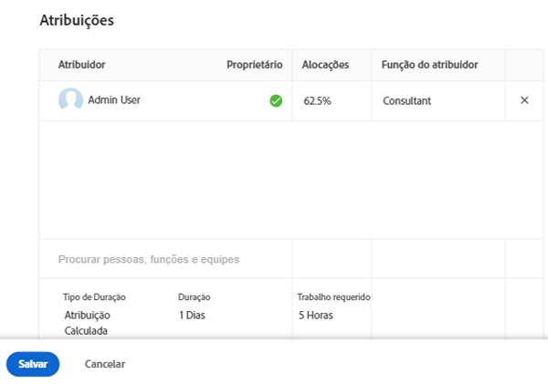
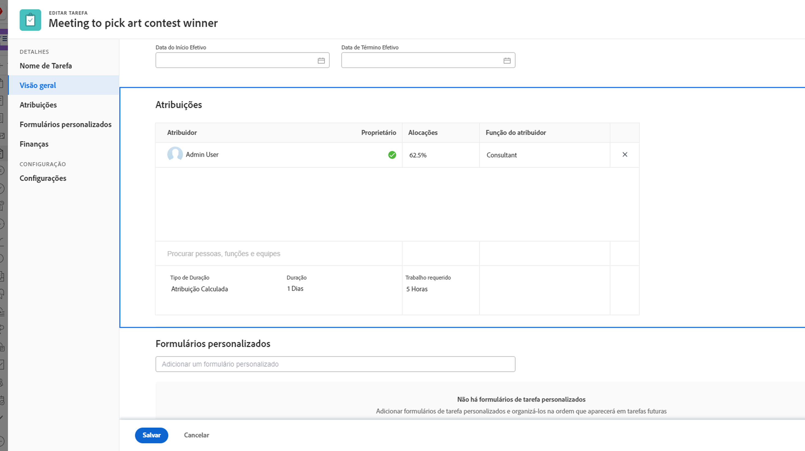

# O que é um destinatário principal?

Um destinatário primário existe quando dois ou mais usuários são atribuídos a uma tarefa. A hora do calendário do destinatário principal é a que o Workfront considera ao aplicar a configuração Tempo de desativação do usuário .

Descubra quem é o destinatário principal na página do projeto. Clique no campo Atribuições e, em seguida, clique no ícone atribuições avançadas no canto.

Na janela Atribuições avançadas, o destinatário principal ou o proprietário da tarefa é designado com uma marca de seleção verde. Passe o mouse sobre outro usuário e clique no link Fazer principal para alterar o proprietário da tarefa.

Também é possível ajustar o destinatário principal na página de tarefas. Marque a caixa na tarefa na lista de projetos e clique no ícone Edit . Role até a seção Atribuições e clique no botão para designar o proprietário da tarefa.

