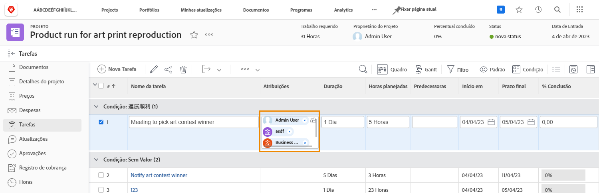
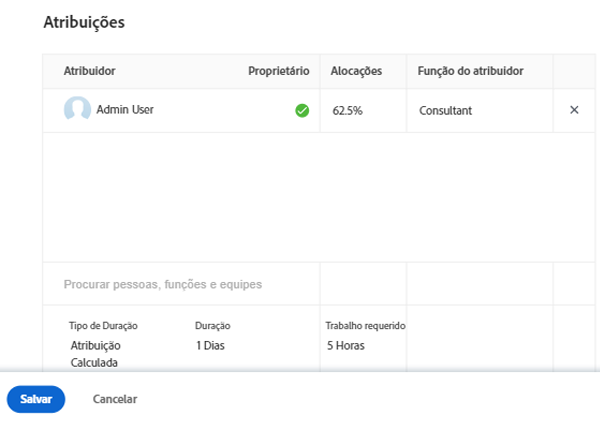
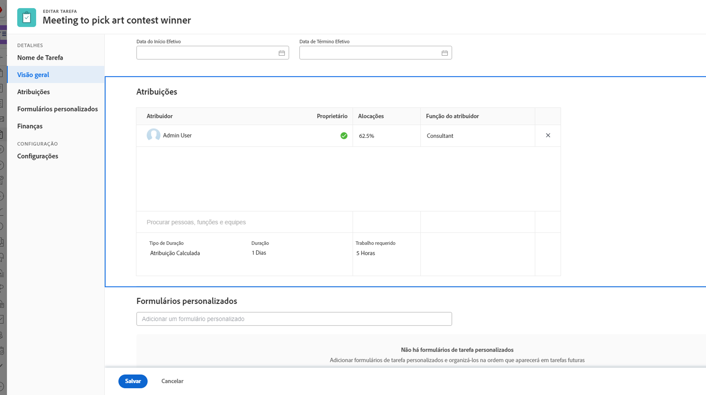

# O que é um cessionário principal?

Um cessionário principal existe quando dois ou mais usuários são atribuídos a uma tarefa. O calendário de folgas do cessionário principal é o que o Workfront analisa ao aplicar a configuração de folgas do usuário.

Descubra quem é o cessionário principal na página do projeto. Clique no campo “Atribuições” e, em seguida, clique no ícone de atribuições avançadas, no canto.

Na janela “Atribuições avançadas”, o cessionário principal, ou proprietário da tarefa, é designado com uma marca de seleção verde. Passe o mouse sobre outro usuário e clique no link “Tornar principal” para alterar o proprietário da tarefa.

Você também pode ajustar o cessionário principal na página de tarefas. Marque a caixa da tarefa na lista de projetos e clique no ícone de editar. Role até a seção “Atribuições” e clique no botão para designar o proprietário da tarefa.

