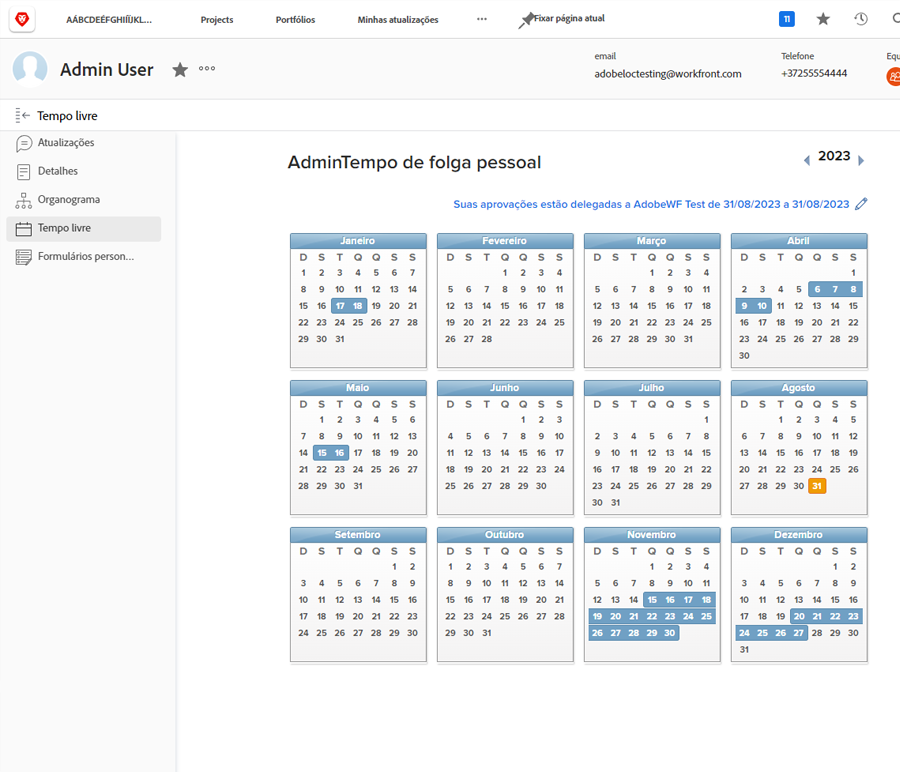
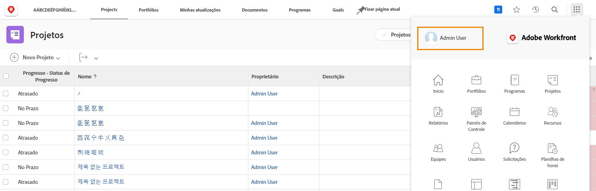
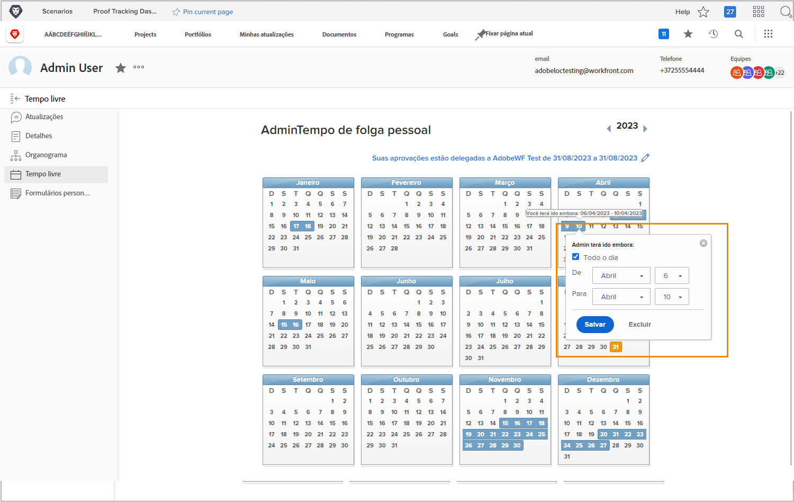

# Por que usar a hora do calendário?

Quando planejadores e gerentes de projeto atribuem tarefas no Workfront, saber quais membros da equipe estão disponíveis para concluir o trabalho atribuído contribui para a conclusão do projeto no tempo.

Os dados precisos de disponibilidade também são reproduzidos no planejamento de trabalho atual e futuro, já que os gerentes de recursos revisam a alocação nas ferramentas de gerenciamento e planejamento de recursos da Workfront.

Os usuários de licença do Workfront Work and Plan podem usar o horário pessoal do calendário para indicar quando estarão indisponíveis durante o horário normal de trabalho. Mesmo um meio dia de folga pode afetar a conclusão das tarefas atribuídas a eles.

**Observação**: A Workfront não foi projetada para replicar ou substituir os sistemas existentes de sua organização para gerenciar, acumular ou rastrear o tempo limite pessoal. Siga as diretrizes da organização para solicitar e gerenciar tempo de folga.

## Marque seu tempo de folga

A hora pessoal do calendário está na página do usuário no Workfront, que é acessada no Menu principal. Clique no seu nome no canto esquerdo.

* Clique em Tempo desligado no menu do painel esquerdo da página do usuário no Workfront.

* Por padrão, o ano atual é exibido. Se necessário, use as setas para selecionar um ano diferente (na parte superior direita da janela do calendário).

* Clique em uma data no calendário.

* A Workfront supõe que você está tirando o dia inteiro de folga. Se esse for o caso, vá em frente e clique no botão Save .

* Se você estiver tirando voo em dias completos consecutivos, altere a data Até para seu último dia fora do escritório. Clique no botão Save .

* Se não estiver tirando o dia inteiro de folga, desmarque a caixa Dia inteiro . Em seguida, indique as horas que você estará trabalhando nesse dia (as horas que você estiver disponível). Clique no botão Save .

Seu tempo de folga é indicado por caixas azuis no calendário. Esse tempo de folga também é exibido em outros lugares do Workfront para auxiliar no planejamento de projetos e recursos.

**Pro-dica**: Se uma tarefa já estiver atribuída a você, você marque a hora no calendário, não haverá notificação enviada ao gerente do projeto para informá-lo que você não estará disponível. Atualize o gerente do projeto com qualquer novo período de folga que possa afetar os projetos atuais ou o trabalho que você recebeu.
