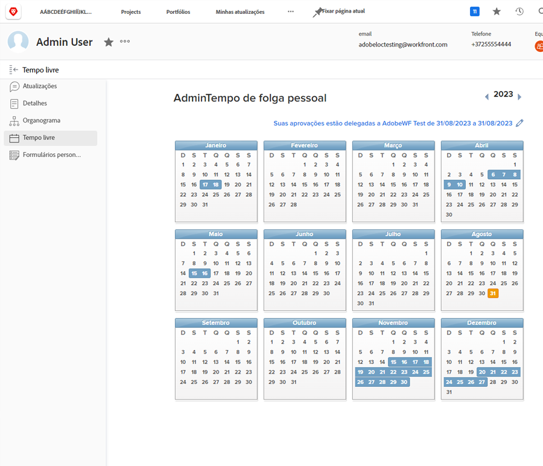
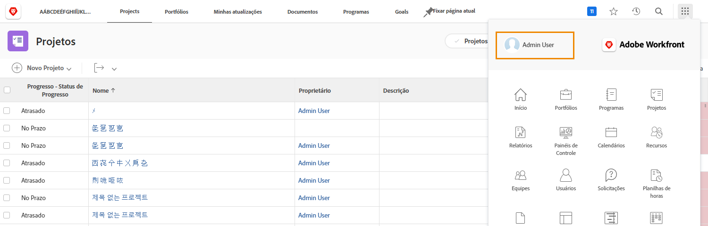
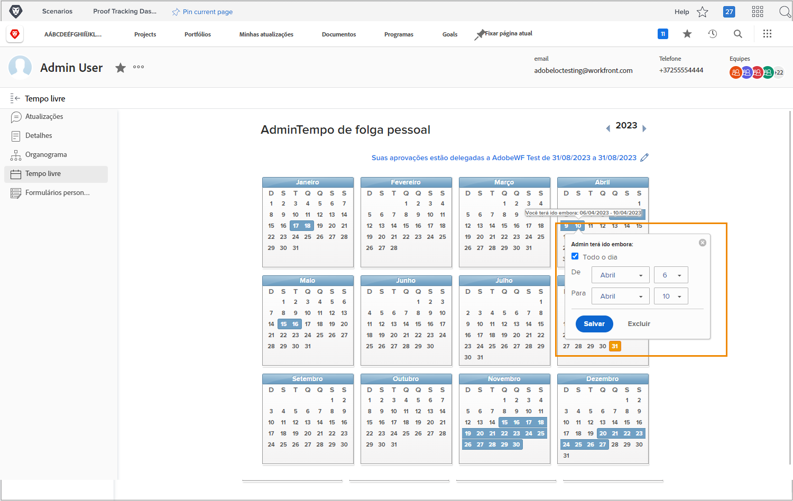

# Por que usar o calendário de folga?

Quando planejadores e gerentes de projeto atribuem tarefas no Workfront, saber quais membros da equipe estão disponíveis para concluir o trabalho atribuído contribui para a conclusão do projeto no prazo.

Dados precisos de disponibilidade também influenciam o planejamento de trabalho atual e futuro, à medida que os gerentes de recursos analisam a alocação nas ferramentas de planejamento e gerenciamento de recursos do Workfront.

Os usuários da licença de Plano e Trabalho do Workfront podem usar o calendário de folga pessoal (PTO) para indicar quando estarão indisponíveis durante o horário normal de trabalho. Mesmo meio dia de folga poderia afetar a conclusão das tarefas atribuídas a eles.

**Observação**: o Workfront não foi projetado para replicar ou substituir os sistemas existentes da sua organização para gerenciamento, acúmulo ou monitoramento de folgas pessoais. Siga as diretrizes de sua organização para solicitar e gerenciar folgas.

## Marque sua folga

Seu calendário de folga pessoal está na sua página de usuário no Workfront, que pode ser acessada no Menu Principal. Clique no seu nome no canto esquerdo.

* Clique em Folga no menu do painel esquerdo na página do usuário no Workfront.

* Por padrão, o ano atual é exibido. Se necessário, use as setas para selecionar um ano diferente (na parte superior direita da janela do calendário).

* Clique em uma data no calendário.

* O Workfront pressupõe que você tirará o dia inteiro de folga. Se esse for o caso, clique no botão Salvar.

* Se você estiver tirando dias inteiros consecutivos, altere a data Para de acordo com seu último dia fora do escritório. Clique no botão Salvar.

* Se você não tirar folga o dia inteiro, desmarque a caixa Dia inteiro. Em seguida, indique o horário em que você trabalhará naquele dia (o horário em que estará disponível). Clique no botão Salvar.

Sua folga é indicada por caixas azuis no calendário. Essa folga também é exibida em outros locais no Workfront para ajudar no planejamento de projetos e recursos.

**Dica profissional**: se uma tarefa já estiver atribuída a você, você marcará a folga no calendário, e nenhuma notificação será enviada ao gerente do projeto para avisá-lo de que você não estará disponível. Certifique-se de atualizar o gerente de projeto com qualquer nova folga que possa afetar os projetos atuais ou o trabalho atribuído a você.
