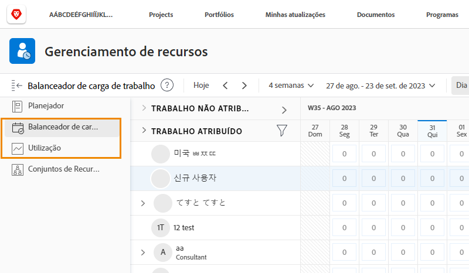

# Configurações de gerenciamento de recursos, Balanceador de carga de trabalho e Relatório de utilização

[!DNL Workfront] oferece dados em várias ferramentas do [!DNL Workfront], para facilitar as decisões de recursos e os processos. Para ver o que está acontecendo com seus recursos, você deve garantir que seus gerentes, usuários e projetos estejam configurados corretamente. Essas configurações são úteis mesmo se você não planeja usar todas as [!DNL Workfront’s] ferramentas de gerenciamento de recursos.

Nesta seção você aprenderá:

* Como configurar gerentes de recursos com o acesso certo
* Como visualizar o Balanceador de Carga de Trabalho e o relatório de utilização

## Configurações de gerenciamento de recursos

Vamos começar certificando-nos de que as pessoas certas tenham acesso e possam administrar os recursos de sua organização.

&lt;!Download the guide for step-by-step instructions.&gt;

## Balanceador de carga de trabalho e relatório de utilização

Juntamente com o Planejador de Recursos e os Pools de Recursos, os usuários têm acesso a ferramentas adicionais, como o Balanceador de Carga de Trabalho e o relatório de utilização, quando recebem a permissão Editar no nível de acesso.

Nenhuma outra configuração é necessária para acessar ou gerenciar recursos por meio dessas ferramentas.

