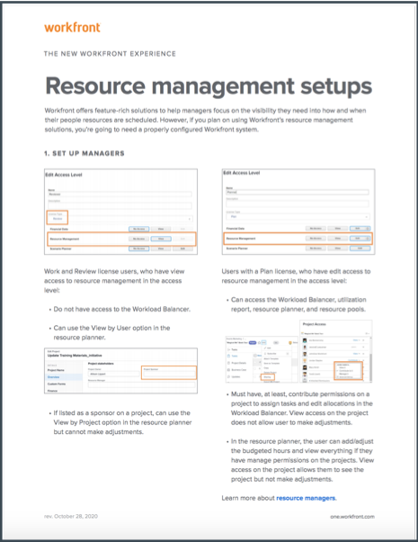
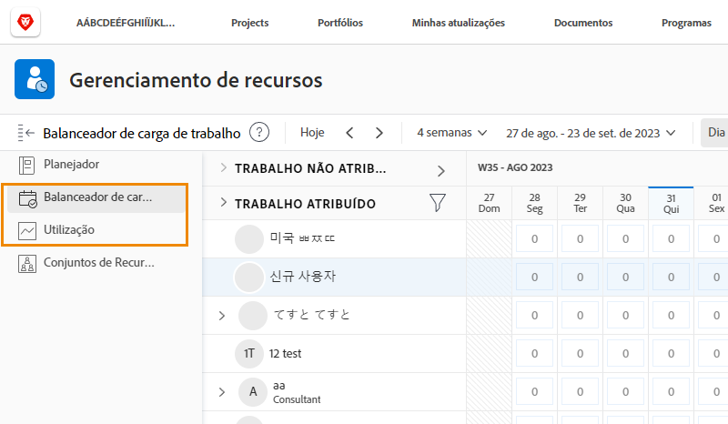

# Configurações de gerenciamento de recursos, Balanceador de carga de trabalho e relatório de utilização

O [!DNL Workfront] oferece dados através de múltiplas ferramentas do [!DNL Workfront], para ajudar a facilitar suas decisões sobre recursos e melhorar os processos. Para ver o que está acontecendo com seus recursos, você deve verificar se seus gerentes, usuários e projetos estão configurados corretamente. Essas configurações são úteis mesmo se você não planeja usar todas as ferramentas de gerenciamento de recursos do [!DNL Workfront's].

Nesta seção, você aprenderá:

* Como configurar gerenciadores de recursos com o acesso correto
* Como visualizar o balanceador de carga de trabalho e o relatório de utilização

## Configurações de gerenciamento de recursos

Vamos começar garantindo que as pessoas certas tenham acesso aos recursos da sua organização e possam administrá-los.

&lt;!Baixe o guia para obter instruções passo a passo.&gt;

## Balanceador de carga de trabalho e relatório de utilização

Além do planejador de recursos e dos conjuntos de recursos, os usuários têm acesso a ferramentas adicionais quando recebem a permissão de Edição, como o balanceador de carga de trabalho e o relatório de utilização.

Nenhuma outra configuração é necessária para acessar ou gerenciar recursos por meio dessas ferramentas.

