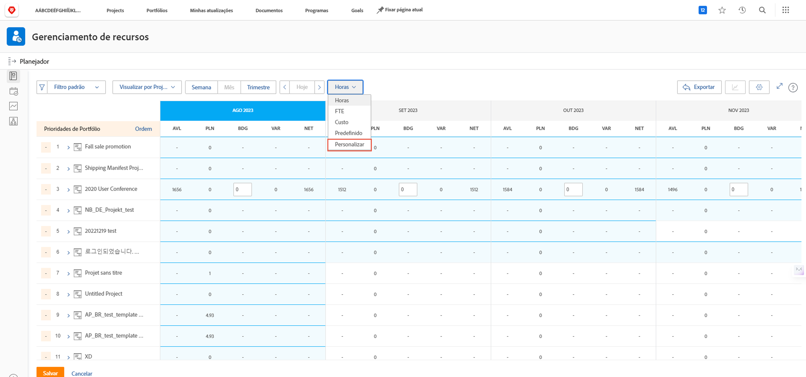
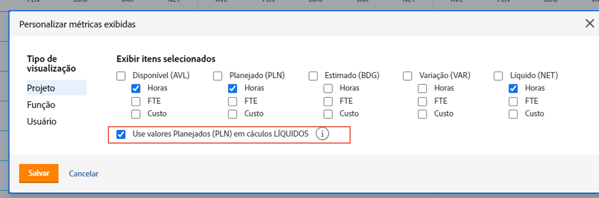
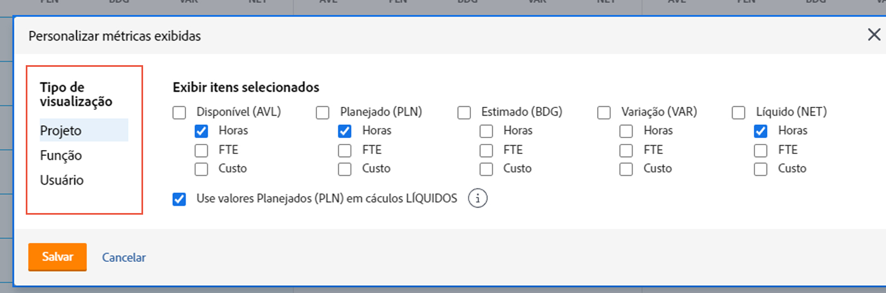
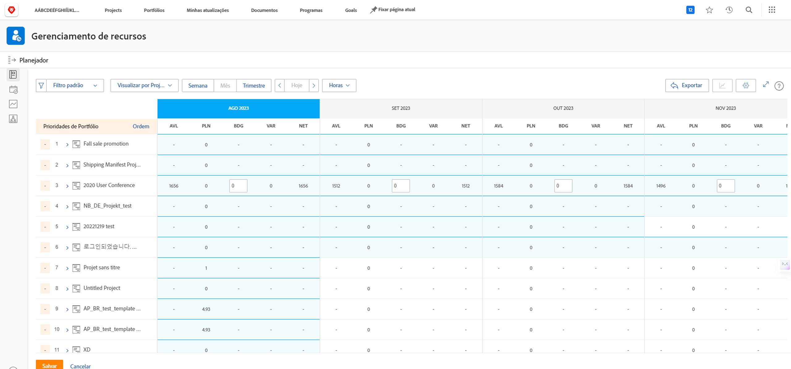

# Exibir por função de trabalho na [!DNL Resource Planner]

Neste vídeo, você vai:

* Consulte [!UICONTROL Visualizar por função de trabalho ]exibir
* Saiba como as informações de recurso são exibidas nesta exibição

>[!VIDEO](https://video.tv.adobe.com/v/335169/?quality=12)

Para a opção Exibir por Função, o padrão é mostrar a coluna Orçado, que extrai o número estimado de recursos necessários para um projeto de um business case, se ele tiver sido preenchido. Isso também significa que a coluna Líquido está, por padrão, usando os números da coluna Orçado para informar quantos recursos restam.

No entanto, sua organização pode não estar usando, ou estar pronta para usar, casos de negócios para estimar esses valores. Em vez disso, use as horas planejadas já inseridas em um projeto. Com a opção Personalizar, você pode escolher quais colunas aparecem na visualização escolhida e como deseja que a coluna Líquido seja calculada.

Para alterar as colunas exibidas e o cálculo de coluna Líquido de modo que seja baseado nas horas planejadas:

* Clique no menu suspenso Hours e selecione Personalizar.

* Na caixa Personalizar métricas exibidas, determine quais colunas são exibidas e marque a caixa próxima a Usar valores planejados (PLN) em cálculos LÍQUIDOS.

**Nota**: é possível editar as colunas e os cálculos para os diferentes tipos de visualização no Planejador de recursos, selecionando uma opção no lado esquerdo da caixa.

* Depois de clicar em Salvar, a caixa é fechada e a tela é atualizada.

O Planejador de recursos mostra o que você precisa saber sobre seu suprimento e demanda sem planilhas complexas e comunicação round-robin.

Com as informações disponíveis e as ferramentas ao seu comando, você pode ajustar a capacidade de sua equipe para executar o trabalho que é importante para você.
