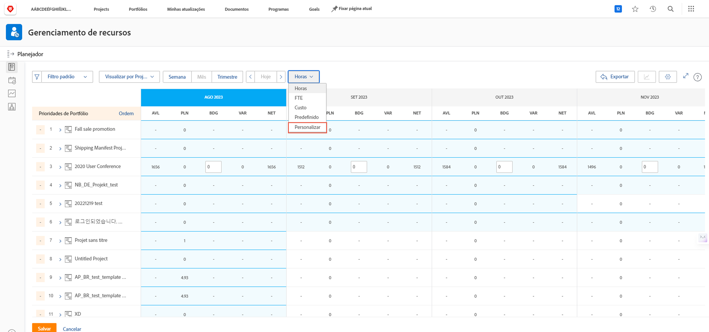
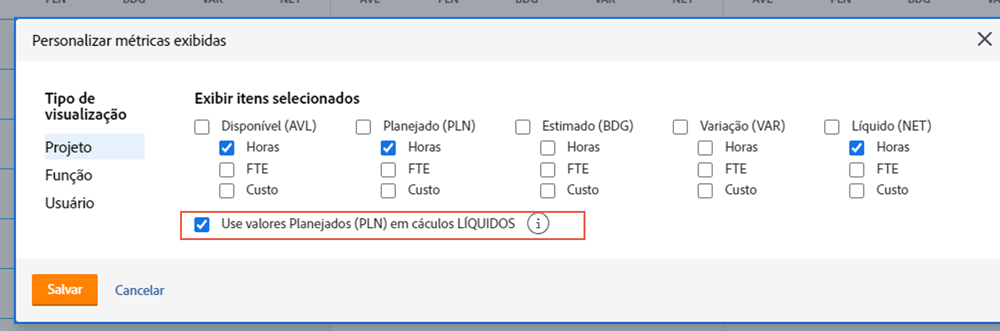
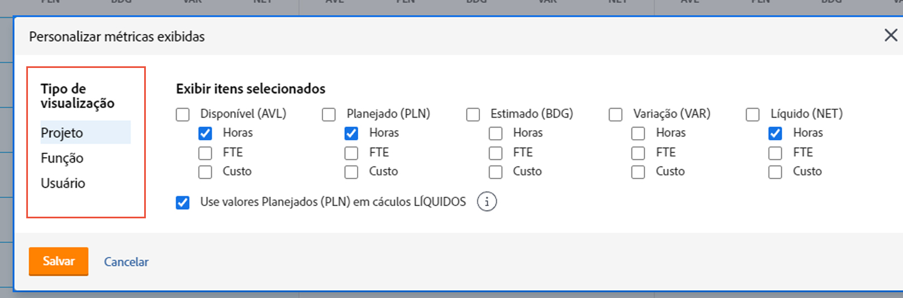
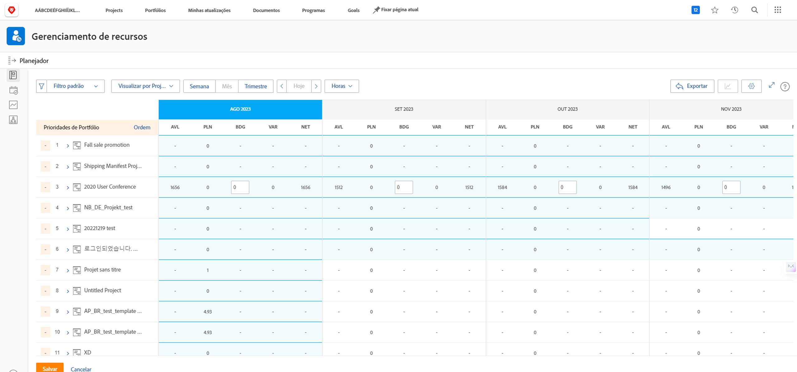

# Visualizar por projeto no [!DNL Resource Planner]

Neste vídeo, você:

* Ver visualização [!UICONTROL Ver por projeto]
* Saiba como as informações de recursos são exibidas nesta visualização

>[!VIDEO](https://video.tv.adobe.com/v/335170/?quality=12&learn=on&enablevpops)

Para a opção Visualizar por Projeto, o padrão é mostrar a coluna Orçado, que extrai o número estimado de recursos necessários para um projeto a partir de um caso de negócios, caso tenha sido preenchido. Isso também significa que a coluna Líquido está, por padrão, usando os números da coluna Orçado para informar quantos recursos restam.

No entanto, a sua organização pode não estar utilizando, ou não estar preparada para utilizar, casos de negócio para estimar esses montantes. Em vez disso, você utiliza as horas planejadas já inseridas em um projeto. Com a opção Personalizar, você pode escolher quais colunas aparecem na visualização escolhida e como deseja que a coluna Líquido seja calculada.

Para alterar as colunas exibidas e o cálculo da coluna Líquida para que seja baseado nas horas planejadas:

* Clique no menu suspenso Horas e selecione Personalizar.

* Na caixa Personalizar métricas exibidas, determine quais colunas aparecem e marque a caixa ao lado de Usar valores planejados (PLN) em cálculos líquidos.

**Observação**: você pode editar as colunas e os cálculos para os diferentes tipos de visualização no Planejador de recursos selecionando uma opção no lado esquerdo da caixa.

* Ao clicar em Salvar, a caixa é fechada e a tela é atualizada.

O Planejador de recursos mostra o que você precisa saber sobre suprimentos e demanda sem planilhas complexas e comunicação round-robin.

Com as informações em mãos e as ferramentas à sua disposição, você pode ajustar a capacidade da sua equipe para executar o trabalho que é importante para você.
