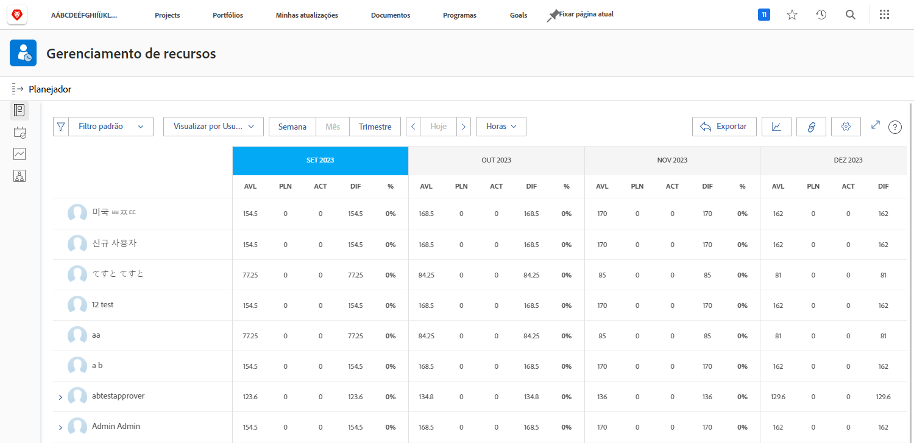

# Visualizar a utilização e filtrar o Planejador de recursos

Com o Planejador de recursos, você obtém uma visão clara dos projetos em que está interessado e uma visão em tempo real de como sua força de trabalho se empilha para executá-los.

* Por exemplo, você quer saber o que acontece com a capacidade quando a iniciativa de atualização de servidor mais recente se torna a sua prioridade máxima.

* O Planejador de recursos mostra a disponibilidade de seus funcionários e como a alocação de recursos para um projeto afetará a disponibilidade em projetos de prioridade mais baixa.

Você poderá ver não apenas como a alocação de recursos afeta o trabalho de hoje, mas como você olha além das necessidades imediatas de programação de recursos, pode avaliar as alocações de recursos de longo prazo para entender se os indivíduos estão acima (ou abaixo) da alocação.

## Filtrar o Planejador de recursos

O Planejador de recursos é aberto automaticamente com um conjunto padrão de filtros. Você editará esses filtros ao:

* Período de tempo
* Portfolio/Programa
* Conjuntos de recursos etc.

Isso permite que você se concentre em quais recursos estão disponíveis e quando.
