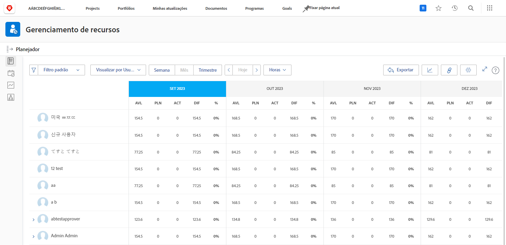

# Visualize a utilização e filtre o Planejador de recursos

Com o Planejador de recursos, você obtém uma visão clara dos projetos nos quais está interessado e um olhar em tempo real em como sua força de trabalho se prepara para executá-los.

* Por exemplo, você deseja saber o que acontece com a capacidade quando a iniciativa de atualização mais recente do servidor se torna sua principal prioridade.

* O Planejador de recursos mostra a disponibilidade do seu pessoal e como a alocação de recursos para um projeto afetará essa disponibilidade em projetos de prioridade mais baixa.

Você poderá ver não apenas como a alocação de recursos afeta o trabalho atual, mas ao olhar além de suas necessidades imediatas de agendamento de recursos, você poderá avaliar as alocações de recursos de longo prazo para entender se as pessoas estão alocadas em excesso (ou a menos).

## Filtrar o Planejador de recursos

O Planejador de recursos se abre automaticamente com um conjunto padrão de filtros. Você desejará editar esses filtros por:

* Intervalo de tempo
* Portfólio/Programa
* Conjuntos de recursos etc.

Isso permite que você se concentre em quais recursos estão disponíveis e quando.
