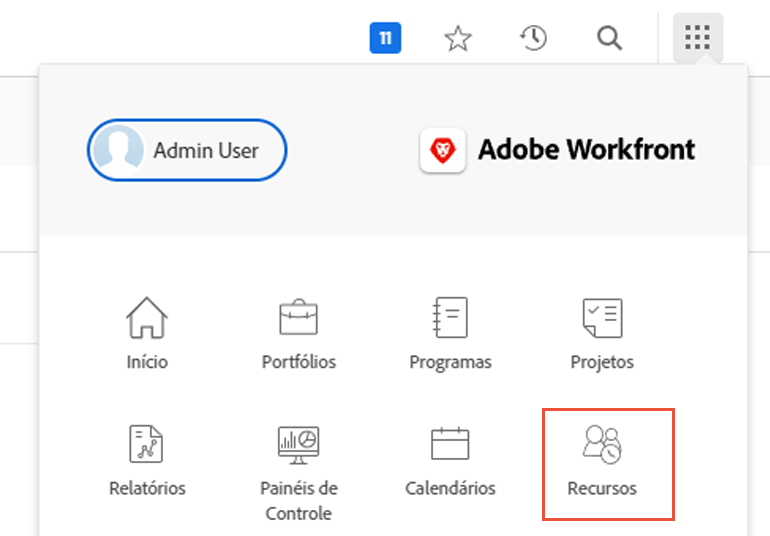
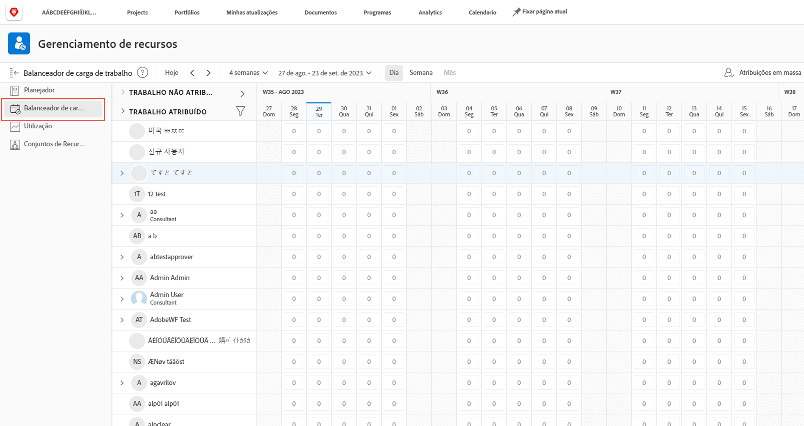
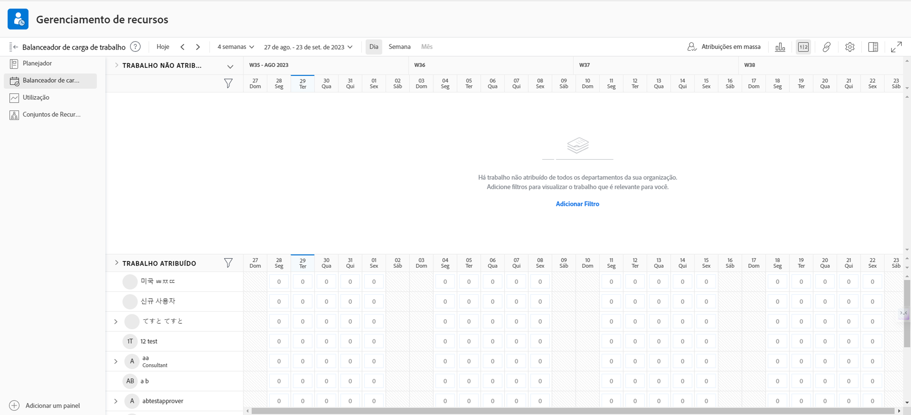
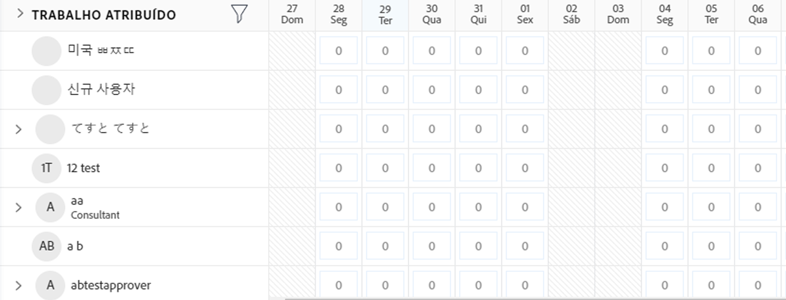
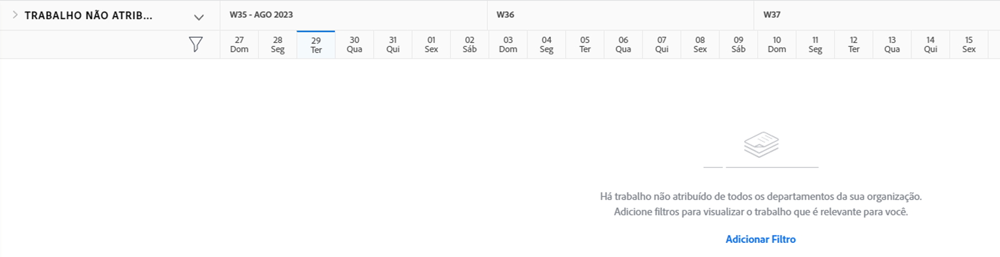

# Localize o [!DNL Workload Balancer]

Saber quais recursos estão disponíveis e como distribuí-los pode ser uma tarefa desafiadora para qualquer pessoa. É por isso que a Workfront criou o [!DNL Workload Balancer].

Sua finalidade é oferecer a você maior compreensão e gerenciamento das cargas de trabalho diárias e semanais das pessoas que você gerencia. Isso ajuda você a fazer atribuições melhores, com base na função e na disponibilidade, em vários projetos.

* Clique em [!UICONTROL Recursos] no [!UICONTROL Menu principal].
* Vá para a [!UICONTROL Agendamento] na área Gerenciamento de recursos.
* Clique em [!UICONTROL &quot;Balanceador de carga de trabalho&quot;] que aparece.

## Áreas no Balanceador de carga de trabalho

Duas seções aparecem na janela [!DNL Workload Balancer]: Trabalho atribuído e Trabalho não atribuído.

A área Trabalho atribuído mostra uma lista de usuários e o trabalho ao qual eles já foram atribuídos no Workfront. Por padrão, essa área é filtrada para usuários que fazem parte das equipes do Workfront às quais você pertence. Dessa forma, você pode ver em quais membros da equipe você está atribuído para trabalhar.

A área Trabalho não atribuído mostra o trabalho que ainda precisa ser atribuído, seja a uma pessoa, função de trabalho ou equipe. No entanto, inicialmente, essa área não mostrará nada.

Começando com a área Trabalho não atribuído em branco, você tem a oportunidade de primeiro se concentrar nas cargas de trabalho atuais de seus usuários, na área Trabalho atribuído, antes de fazer atribuições.
